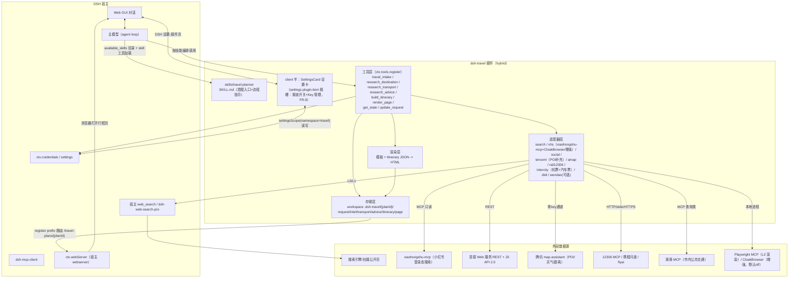
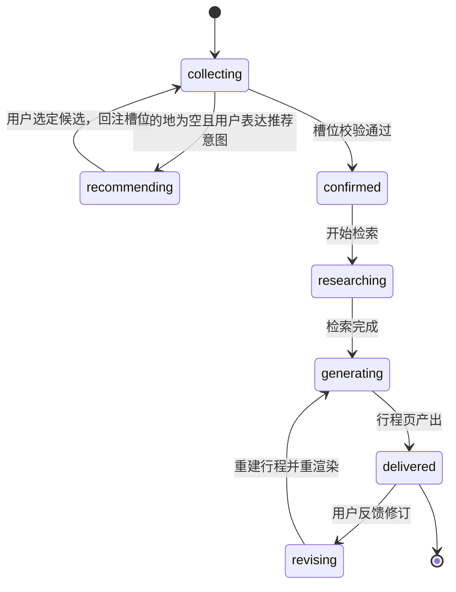
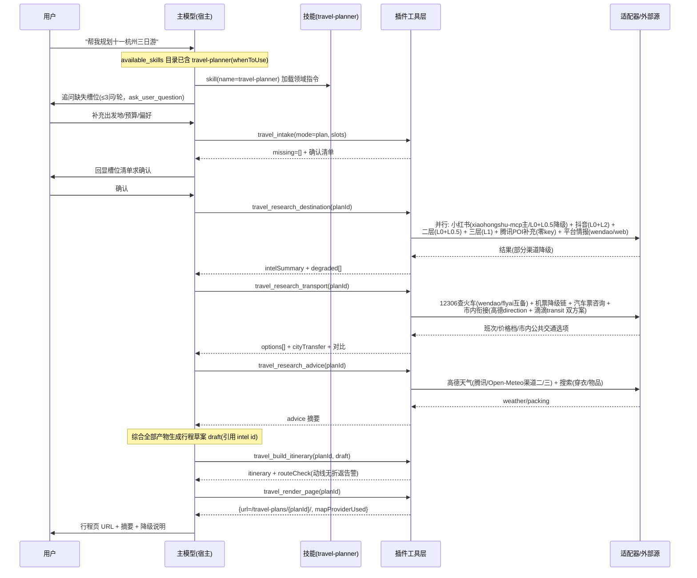

# 旅行规划 DSH 插件 · 设计文档

| 项 | 内容 |
|---|---|
| 文档版本 | v2.2（v2.1 基础上，新增 FR-8 设置页设计：渠道开关矩阵 + Key CRUD，settings.plugin.item 插槽注册，§10.1） |
| 项目代号 | dsh-travel（暂定） |
| 配套文档 | [需求文档](./requirements.md) |
| 调研档案 | [CloakBrowser 与备选](./research/cloakbrowser.md) · [携程问道与平台数据](./research/ctrip-wendao-platforms.md) · [高德地图开放平台](./research/amap.md) · [可复用开源方案](./research/reusable-opensrc-mcp.md) · [DSH 插件框架 API](./research/dsh-plugin-api.md) · [DSH 插件生态](./research/dsh-plugin-ecosystem.md) · [workbuddyskills 资产评估](./research/workbuddyskills.md) · [L0/L1 社媒检索实测](./research/l0-social-search-test.md) |

---

## 1. 概述

### 1.1 目标回顾

以 DSH 插件实现：**自然语言旅行需求 -> 意图激活 -> 多轮信息收集 -> 目的地情报/交通/出行建议检索 -> 行程方案生成 -> 含真实地图组件的可视化 HTML 行程页**。

### 1.2 设计原则

1. **复用优先**：能借力宿主已有能力（LLM、web_search、子代理、MCP client、credentials）与生态成熟件就不自建。
2. **诚实降级**：每个外部数据源都有降级链，任一源失效只损失局部信息，不阻塞流程（对应 NFR-2）。
3. **双渠道冗余**：**每项功能需求至少保留两个实现渠道，每个渠道均含降级路径**（v2.0 起为硬约束，落地矩阵见 §2.1）。
4. **来源可溯**：所有进入行程页的信息带 来源平台 + URL + 获取时间（对应 NFR-3）。
5. **合规红线内置**：只查询展示、不做自动化购票/抢票；抓取有频控；不存储账号密码类凭据（对应 NFR-4，详见 §5.6）。
6. **模块化数据源**：适配器层隔离外部源，换源不改流程层（对应 NFR-7）。
7. **最小密钥启动**：不配任何 key 也能跑通降级版（零 key 流见 §4.4）；每加一个 key 解锁一层能力。

---

## 2. 需求到实现的映射

| 需求 | 实现机制 | 说明 |
|---|---|---|
| FR-1 意图触发与插件加载 | **SKILL.md（`whenToUse`）+ 常驻工具注册 + 工具描述约束** | ⚠️ 调研确认 DSH **无「意图识别->自动挂载」专用引擎**（[DSH API 档案 Q4](./research/dsh-plugin-api.md)）。实际机制：插件技能进入 `<available_skills>` 目录，模型识别旅行意图后调用 `skill` 工具加载技能正文；工具集随插件常驻注册，由技能指令约束仅在旅行流程中调用。效果上等价于"意图命中后加载"，机制上是"目录展示+模型自选"。显式 `/travel` 命令作兜底入口。单点查询意图走轻量路径（见 §7）。 |
| FR-2 多轮信息收集（含目的地推荐模式） | SKILL.md 指导模型追问 + 宿主 `ask_user_question` 工具 + `travel_intake`（校验/持久化/缺口反馈） | 追问对话由主模型完成；`travel_intake` 把"收集是否完整"变成确定性校验。目的地推荐模式（目的地为空）：模型基于宿主 web_search 生成候选目的地 -> 用户选定 -> 回注槽位 -> 转入规划模式（状态机见 §5.4）。 |
| FR-3 目的地情报 | **社媒检索（三层渠道，见 §5.4）+ 腾讯地图 POI 搜索补充**：①社媒按三层优先级（小红书/抖音 > 知乎/B站 > 微博/豆瓣/贴吧/快手）逐渠道检索，**小红书主路径=xiaohongshu-mcp 登录态搜索**（ADR-4，未部署时降级 L0+L0.5）；②腾讯地图 POI 搜索（tencentmap-map-assistant，零 key 可用，含评分/人均/营业时间）作结构化补充；③平台情报经携程问道与 web_search | 7 类信息聚合，条目带来源；渠道可达性均已实测验证（见 [L0/L1 实测档案](./research/l0-social-search-test.md)与 §5.4）。 |
| FR-4 交通检索与组合 | `travel_research_transport`：**城际**=火车票 12306 MCP（P0，携程问道/flyai 互备）+ 机票（携程问道 P0 -> flyai -> 搜索降级）+ 汽车票（P1：携程问道咨询级 + 搜索）；**市内衔接=高德 direction（transit）+ 滴滴 MCP maps_direction_transit 双方案**，作为公共交通选项提供 | 12306 **只读查询**红线内置；汽车票结构化数据源列入未确认清单（§13）。 |
| FR-5 出行建议 | `travel_research_advice`：高德天气（行程期逐日，渠道二=腾讯 weather 零key -> Open-Meteo 免key）+ 搜索（穿衣/物品） | 物品清单由模型结合槽位画像定制。 |
| FR-6 行程方案生成 | 主模型生成草案 + `travel_build_itinerary`（draft 入参落盘 + 动线校验：高德距离/路线为主，腾讯 distance_matrix 零key 为渠道二，直线距离估算兜底）；tencentmap travel_guide 可作结构化行程素材补充 | 动线校验避免"跨城折返"硬伤；draft 参数支撑增量修订。 |
| FR-7 可视化展示 | `travel_render_page`：模板渲染自包含 HTML -> `ctx.webServer.register({kind:"prefix"})` 在线访问 + 本地文件双交付 | 地图组件：高德 JS API 2.0（有 key）<br>Leaflet+OSM（无 key 降级）。 |
| FR-8 设置页 | **client 半设置卡**（`ctx.slots.inject('settings.plugin.item')` 注册进 DSH 设置-插件页，先例=dsh-web-search-pro SettingsCard）+ **settings 命名空间 `travel` 持久化**（`settingsScope.bind({namespace:'travel'})`，key 字段 `role('secret')` 自动脱敏）：功能渠道开关矩阵（FR-3~7 × 渠道独立启停）+ 渠道 Key CRUD；工具每次执行热读取最新配置（保存即生效）。详见 §10.1 | 注册机制已由 dsh-web-search-pro 同形态验证（client 模块 `exports["./client"]` + slots 注入 + settingsScope）；保存时执行 NFR-10 冗余校验（<2 渠道警示）。 |

### 2.1 全需求渠道与降级矩阵（设计原则 3 的落地与验收口径）

| 需求 | 渠道一 | 渠道一降级链 | 渠道二 | 渠道二降级链 | 渠道三 |
|---|---|---|---|---|---|
| FR-1 意图触发 | 技能机制（available_skills 目录 + 模型自选加载） | 技能未被加载/命中失败 -> 渠道二 | 显式 `/travel` 命令 | —（兜底通道本身） | — |
| FR-2 信息收集 | `ask_user_question` 结构化提问（选项化） | 工具不可用 -> 自然语言对话追问（SKILL 规则不变） | `travel_intake` 确定性槽位校验 | 工具失败 -> 模型按 SKILL 清单人工核对并明示 | travel_update_request（修订/推荐模式回注） |
| FR-3 社媒情报 | 三层社媒渠道（渠道内部见 §5.4 五层降级链；小红书主=xiaohongshu-mcp） | 每渠道五层降级至"标注缺失"（NFR-2） | 腾讯地图 POI 搜索补充（poi_search/poi_nearby，零 key 体验通道） | 体验通道限流 -> 正式 TMAP key；仍失败 -> 高德 POI（基础搜索配额）；最终标注缺失 | 平台情报：携程问道（有 key）-> web_search 公开评价页 |
| FR-4 城际交通 | 12306 MCP（火车） | 携程问道/flyai 互备 -> 搜索结果结构化 | 携程问道（机票/汽车票） | flyai（零 key 可试）-> 搜索降级 + 官方购票渠道链接 | — |
| FR-4 市内衔接 | 高德 direction（transit，含票价与 polyline） | 高德失败 -> 渠道二；均失败 -> L0 搜索"机场/车站->市区 交通" | 滴滴 MCP `maps_direction_transit`（公共交通选项；`taxi_estimate` 可作价格参考） | 滴滴失败 -> 渠道一；估价不可用则省略该字段 | — |
| FR-5 天气 | 高德 weather（逐日） | 高德失败 -> 渠道二/三 | 腾讯 weather（零 key，5 天预报实测） | — | Open-Meteo（免 key；失败再降 wttr.in） |
| FR-5 穿衣/物品 | web_search 检索 | 检索失败 -> LLM 按槽位画像生成并标注"未经检索验证" | LLM 画像生成（常识兜底） | — | — |
| FR-6 行程生成 | 宿主 LLM（生成草案） | 失败重试（计入 NFR-1 重试上限） | 动线校验：高德 distance_matrix/direction | 高德失败 -> 腾讯 distance_matrix（零 key）-> 直线距离估算（标注） | tencentmap travel_guide（结构化行程素材，可选） |
| FR-7 地图组件 | 高德 JS API 2.0（Web 端 key+jscode） | 无 key/加载失败 -> 渠道二 | Leaflet + OSM（免 key） | OSM 瓦片不可用 -> 列表视图（无地图，标注） | — |
| FR-7 页面交付 | webserver prefix 路由在线访问 | 路由注册失败 -> 渠道二 | 本地文件路径（下载/离线打开） | — | — |

> 验收口径：任意单一渠道失效时，对应需求仍有可用产出（允许降级形态），全流程不中断。

---

## 3. 候选工具可行性评估

评估维度：**功能覆盖度**（相对 FR-3/4/5/7 的需求面）、**可靠性**（稳定性/维护活跃度/风控风险）、**接入成本**（key/依赖/封装工作量）、**局限与合规**。

### 3.1 xiaohongshu-mcp（xpzouying）-- 结论：**核心采用（小红书登录态搜索主路径，ADR-4，v2.0 起）**

| 维度 | 评估（证据：[CloakBrowser 档案](./research/cloakbrowser.md) 备选段，2026-09-01 核验） |
|---|---|
| 是什么 | 专用小红书 MCP 服务（`search_feeds` 搜索 / feed 阅读 / 评论等），Playwright 无头浏览器 + 扫码登录（会话持久化） |
| 开源/活跃 | **Apache-2.0，约 15.6k stars，活跃维护**；Docker 分发；另有 x-mcp 浏览器插件版（会话留在用户自己浏览器，合规姿态更优） |
| 可靠性 | 作者自述"原项目稳定运行一年多无封号（仅 cookies 过期需重登）"；被 Agent-Reach（约 77k stars）列为小红书路由后端之一（生态验证） |
| 接入成本 | 低：MCP 标准，宿主 dsh-mcp-client 直接挂载（本机 mcp-lexiang 先例）；首启自动下载无头浏览器（约 150MB）；无 API key（登录态经自身扫码建立） |
| 局限与合规 | 普通无头浏览器无源码级反指纹；**同一账号仅允许单网页端会话**（别处登录网页端会踢出会话）；自带发布/评论等工具须收敛为只读（工具白名单）；登录态合规边界适用（§5.6） |
| **定位** | **小红书情报主路径**（`search_feeds` 只读挂载）；CloakBrowser 为高风控场景增强（§3.2）；未部署/未授权时降级 L0+L0.5（ADR-4） |

### 3.2 CloakBrowser -- 结论：**增强方案（高风控场景的反检测增强，默认关闭）**

| 维度 | 评估 |
|---|---|
| 是什么 | 源码级（C++ 补丁编译进 Chromium）反指纹浏览器，Playwright/Puppeteer 无缝替代库；官方仓库 `CloakHQ/CloakBrowser`（约 31k stars，活跃） |
| 功能覆盖 | 登录态保持（持久 profile/storage_state）、fingerprint seed 固化身份、SOCKS5/HTTP 代理、`geoip` 时区对齐、`humanize` 人类化行为 |
| 可靠性 | 中高：dev.to 反检测实测 14/20（第二）、唯一通过真实 Cloudflare challenge；但**补丁源码未公开**（MIT 仅覆盖 wrapper 层），社区存在安全审计项目 |
| 接入成本 | 低-中：npm/pip 库，API 与 Playwright 完全兼容；freemium--免费档仅**单并发会话**，多会话需 Pro（价格未公示）；**需自带代理**；无官方 MCP/REST |
| 局限与合规 | 闭源二进制信任风险；反爬对抗的账号封禁与法律风险由使用方承担；合规边界见 §5.6 |
| **定位** | **小红书登录态抓取的增强方案**（ADR-4：当 xiaohongshu-mcp 遭风控/需要更强反检测时启用）；默认 off，双重授权开启。详见 [CloakBrowser 档案](./research/cloakbrowser.md) |

### 3.3 携程问道 -- 结论：**有限采用（查询型结构化数据源，已实测验证，~6/10）**（证据：[携程问道与平台数据档案](./research/ctrip-wendao-platforms.md)，含 2026-08-31 实测记录）

| 维度 | 评估 |
|---|---|
| 是什么 | 携程 2023-07 发布的旅游垂直大模型（200 亿旅游数据+携程结构性实时数据），官方开发者 API 真实存在 |
| 接入（**实测**） | `POST https://wendao-skill-prod.ctrip.com/skill/query`（官方 tripai-skill 仓库口径），JSON payload `{token, query, source}`；响应为**纯 Markdown 文本**（非 JSON 包裹），单次 1~20s；key 经 `www.ctrip.com/wendao/openclaw` 申请（本设计已持真实 key 实测可用，8/8 调用成功） |
| 功能覆盖（**实测**） | ✅ 机票（航司/机型/时刻/价格+携程深链）、火车票（G/D/C 车次/票价/开售状态）、酒店（名称/位置/评分/价格区间/选区建议）、景点门票（价格/开放时间）、美食（菜品+餐厅+人均）；⚠️ 汽车票为**咨询级**（车站/票价区间/车程，无实时班次）；❌ 行程规划返回空壳（实测无内容）；❌ 无预订交易（多处明示"无法完成预订"） |
| 可靠性 | 中：官方背景、实测数据质量高（中文国内优于国际比价源）；但 QPS/配额不透明、定价未公开（实测 8 连调无异常，上限未知），返回可能含营销链接需过滤 |
| 局限与合规 | 非 MCP 标准协议（适配器按 Markdown 解析、提取 m.ctrip.com 深链作 source.url）；配额无 SLA；引用其结果需注意版权与链接回带 |
| **定位** | 查询型结构化源（有 key 时）：①机票查询首选；②国内住宿结构化源；③火车票冗余源（与 12306 MCP 互备）；④美食/门票信息源；⑤汽车票咨询信息。行程生成不可用（宿主 LLM 承担，无冲突）。无 key 时走降级链。 |

### 3.4 高德地图开放平台 -- 结论：**核心采用（地图与 LBS 数据基座），「REST 数据 + JS API 组件」组合，CLI 按场景选用**

调研确认高德为 AI Agent 场景提供三件套（官方维护）：

| 形态 | 事实 | 对本插件的用途 |
|---|---|---|
| **官方 MCP**（`https://mcp.amap.com/mcp?key=<key>`） | Streamable HTTP（SSE 已下线）；复用 Web 服务 key；16 工具 | 与 REST 同 key 同能力；本插件默认走 REST 适配器（配额统计/缓存/错误可控），MCP 为宿主级备选 |
| **官方 CLI**（`npm i -g @amap-lbs/amap-gui`） | SKILL 技能包 + CLI 指令集 + GUI 可视化容器 | 面向"Agent 操控本地交互式地图容器"场景；本插件主交付为浏览器行程页，CLI 保留可选接入位 |
| **Web 端 JS API 2.0** | 浏览器端地图组件；需「Web 端(JSAPI)」key + 安全密钥 jscode（与 Web 服务 key 不同平台产物，不可混用；可配域名白名单）；markers/polyline/InfoWindow 齐全 | **FR-7 行程页地图组件实现基座**（Yangjon1/trip_agent 已验证同路径） |

**配额与成本注意（月配额制，个人认证免费 1 年；数字见 [高德档案](./research/amap.md)）**：

| 服务类别 | 个人配额 | 对本插件的策略 |
|---|---|---|
| 基础搜索（POI 关键词/周边等） | 5,000/月（硬约束，三端共享） | **FR-3 POI 检索主路径已移至腾讯 map-assistant（零 key，§3.5）**；高德 POI 仅作降级（仍执行缓存 30 天 + 单次规划 ≤40 次实调 + 计数告警） |
| 基础 LBS（路径规划/距离/地理编码/静态图等） | 15 万/月 | 充裕：FR-4 市内衔接、FR-6 动线校验、坐标兜底主力使用 |
| JS 地图图面初始化 | 150 万/月 | 充裕：行程页加载不计紧张池 |
| 天气查询 | 配额分类未确认 | 按保守预算管理（单次规划 ≤ 每日 1 次）；渠道二/三为腾讯 weather 与 Open-Meteo |

**关键澄清**：把 POI 检索从浏览器前端挪到服务端 REST，消耗的仍是「基础搜索」配额池（三端共享）——收敛服务端的收益是调用计数、缓存与错误控制可控，而非更高配额。前端零 POI 调用（纯渲染后端产出坐标）。离线/内网无官方方案，降级路径见 §8 与 §9.3。

### 3.5 新增核心组件：滴滴 MCP 与腾讯 map-assistant（v2.0 起）

| 组件 | 角色 | 关键事实 |
|---|---|---|
| **滴滴 MCP**（didi-ride-skill，官方） | FR-4 市内衔接渠道二（公共交通选项） | 13 工具：地图查询类 7 件（`maps_direction_driving/transit/walking/bicycling`、`maps_place_around`、`maps_textsearch`、`maps_regeocode`）+ 估价/App 深链可用；**交易类 4 件（下单/订单/司机位置/取消）红线排除**；接入=MCP（mcporter）+ `DIDI_MCP_KEY`（App 扫码获取）；transit 需完整城市名（"北京市"）；证据：[workbuddyskills 档案](./research/workbuddyskills.md) |
| **tencentmap-map-assistant**（腾讯位置服务官方 skill） | FR-3 POI 搜索补充 + FR-6 校验渠道二 + FR-5 天气渠道二 | **零 key 实测 9 项全通过**：`poi_search`/`poi_nearby`（**含 star_level/avg_price/opening_hours**）、`direction`（transit 含票价）、`weather`（5 天预报）、`distance_matrix`、`travel_guide`（结构化多日行程素材）、geocoder；体验通道 `h5gw.map.qq.com` 零 key，正式 key 增稳；坐标 GCJ02；证据：[workbuddyskills 档案](./research/workbuddyskills.md) 深度核验节 |

### 3.6 候选工具评估总结

| 工具 | 采用决策 | 角色 |
|---|---|---|
| **xiaohongshu-mcp** | **核心采用（主路径）** | 小红书登录态搜索（`search_feeds` 只读），ADR-4 |
| CloakBrowser | 增强方案（默认 off） | 高风控场景反检测增强，ADR-4 |
| **携程问道** | 有限采用（有 key 时） | 机票首选/住宿/火车互备/美食门票/汽车票咨询 |
| **高德开放平台** | **核心采用** | FR-4 市内衔接/FR-5 天气/FR-6 动线校验/FR-7 JSAPI 地图 |
| **滴滴 MCP** | 采用（FR-4 市内衔接渠道二） | 公共交通选项 + 估价参考（查询类工具 only） |
| **tencentmap-map-assistant** | 采用（FR-3 POI 补充主路径） | POI（评分/人均/营业时间）+ 天气/距离渠道二 + travel_guide 素材 |

（已调研但未采用的工具已精简移除，清单与理由见 §13 精简记录；完整调研材料保留于 research/ 档案。）

---

## 4. 可复用方案调研与选型建议

### 4.1 开源 DSH 插件（GitHub `dsh-plugin` topic 实测检索，2026-08-31；证据：[DSH 插件生态档案](./research/dsh-plugin-ecosystem.md)）

**结论：无旅行/地图/浏览器自动化类现成 DSH 插件（空白区）；搜索类复用收敛为一项。**

| 插件 | ★ | 采用决策 |
|---|---|---|
| **dsh-web-search-pro** | 58 | **采用**：L1 定向渠道。源码核验（2026-09-01）：知乎/微博/豆瓣/贴吧/抖音/快手=内置 Playwright+storageState 登录态读搜索页 DOM（L1+L2 级能力，`save-login.mjs` 一次登录）；小红书不在其内置通道（已由 xiaohongshu-mcp 承担）。详见 [L0/L1 实测档案](./research/l0-social-search-test.md) |

（其余搜索类插件已精简移除；完整检索快照见 [DSH 插件生态档案](./research/dsh-plugin-ecosystem.md)。）

### 4.2 GitHub 开源项目（LLM 旅行规划；证据：[可复用开源方案档案](./research/reusable-opensrc-mcp.md)）

**结论：无高星完整应用；价值在编排模式与地图路径的已验证先例。**

| 项目 | ★ | 借鉴点 |
|---|---|---|
| arpan65/TripAI-Multi-Agent-AI-Travel-Planner | 6 | **编排模式**：4 阶段串行管线 + Playwright MCP 实时抓价 + SSE 流式，与 DSH 形态同构 |
| Yangjon1/trip_agent（中文） | 1 | **完整先例**：LangGraph 五步 + 高德 MCP + 高德 JS API 2.0 按天分色地图可视化（本设计同路线的验证） |
| OSU-NLP-Group/TravelPlanner | 542 | **评测集**：1,225 个真实规划任务 -> M3 回归评测素材 |

### 4.3 现成 MCP 服务（v2.0 精简后）

| 类别 | 采用 | 降级 |
|---|---|---|
| 小红书登录态搜索 | **xpzouying/xiaohongshu-mcp**（主路径，`search_feeds` 只读） | L0 种子+L0.5 直抓；CloakBrowser 增强（高风控） |
| 火车票 | **drfccv/mcp-server-12306**（活跃，Python，stdio+HTTP 双模式，余票/票价/3382 车站/换乘/经停） | 携程问道/flyai 互备 -> 搜索结构化 |
| 机票 | **携程问道 API**（实测可用，首选） | **flyai**（飞猪官方 CLI `@fly-ai/flyai-cli`，零 key 可试用、正式需 key）-> 搜索降级 |
| 汽车票（P1） | 携程问道（咨询级：车站/票价区间/车程） | 搜索结果结构化 + 官方购票页链接 |
| 市内交通（FR-4） | **高德 direction（transit）** | 互为降级（§2.1）；估价参考 taxi_estimate |
| 地图/LBS（FR-4/5/6/7） | **高德 Web 服务 REST**（路线/天气/距离/JSAPI key 下发） | 腾讯 map-assistant（零 key）承担渠道二 |
| POI 补充（FR-3） | **tencentmap-map-assistant**（零 key，含评分/人均/营业时间） | 正式 TMAP key -> 高德 POI（配额约束）-> 标注缺失 |
| 网页抓取（L2） | **microsoft/playwright-mcp**（约 36.6k stars，Apache-2.0，**免 key 本地无头浏览器**） | 标注「仅摘要」 |
| 搜索（L0） | **宿主自带 web_search**（dsh-web-search-deepseek） | 渠道二=dsh-web-search-pro（定向+登录态平台） |
| 住宿（国内，FR-3） | **携程问道**（实测：酒店/位置/评分/价格区间/选区建议） | 社媒三层渠道 + 腾讯 POI 补充 |

**红线**：12306 相关一律**只读查询展示，绝不自动化购票/抢票**（2026-04 国铁约谈第三方、有刑事判例；详见 [携程问道与平台数据档案](./research/ctrip-wendao-platforms.md)）。宿主侧 MCP 接入通道已验证（本机 dsh-mcp-client，mcp-lexiang 先例）。

### 4.4 选型建议汇总（数据源矩阵，v2.0）

| 需求 | v1 默认 | +key 增强 | 免 key 降级（零 key 流） |
|---|---|---|---|
| 小红书情报 | **xiaohongshu-mcp 登录态搜索**（部署即用，无 API key）`[登录态]` | CloakBrowser 反检测增强 `[需license，默认off]` | **L0 种子（site: 搜索）+ L0.5 直抓（正文全文+互动数据）** `[免key]` |
| 抖音情报 | L0 搜 URL + **L2 Playwright MCP 渲染正文** `[免key]` | L1 dsh-web-search-pro 登录态定向 `[插件]` | 同默认 |
| 知乎/B站情报 | L0 + L0.5 直抓 `[免key]` | L1 dsh-web-search-pro 登录态定向 `[插件]` | 同默认 |
| 微博/豆瓣/贴吧/快手 | L1 dsh-web-search-pro 登录态定向 `[插件]` | — | L0 搜索 `[免key]` |
| POI 补充（评分/人均/营业时间） | **腾讯 map-assistant**（零 key）`[免key]` | 正式 TMAP key 增稳 `[需key]` | 高德 POI（5000/月硬约束）`[需key]` -> 标注缺失 |
| 平台情报（携程/同程/点评/美团） | web_search 公开评价页 `[免key]` | 携程问道（攻略/结构化）`[需key]` | ❌ 不直接爬平台（无公开 API+强反爬+法律风险） |
| 火车票 | drfccv/mcp-server-12306 本地部署 `[免key]` | 携程问道/flyai 互备 `[需key]` | 搜索结果结构化 |
| 机票 | 搜索降级 `[免key]` | 携程问道（首选）/ flyai `[需key]` | 提示人工比价 + 官方渠道链接 |
| 汽车票（P1） | 携程问道咨询级 + 搜索 `[免key起]` | — | 同默认 |
| 市内衔接 | **高德 direction（transit）+ 滴滴 MCP 双方案** `[高德需key；滴滴需key]` | — | L0 搜索"机场->市区 交通" `[免key]` |
| 天气 | 高德 weather `[需key]` | — | **腾讯 weather（零 key）-> Open-Meteo** `[免key]` |
| 行程页地图 | **高德 JS API 2.0** `[需key]` | — | **Leaflet + OSM** `[免key]` |
| 行程生成/编排 | 宿主 LLM + 本插件技能与工具 `[免key]` | — | — |

**零 key 流**（设计原则 7 的落地）：L0 搜索 + L0.5 直抓 + 12306 MCP + **腾讯 map-assistant（POI/天气/距离全套，零 key 实测）** + Open-Meteo + Leaflet 地图 -> 全流程可跑通降级版（小红书为种子+直抓抽样）。

### 4.5 可参考技能/连接器仓库（workbuddyskills）

[workbuddyskills](https://github.com/infometa/workbuddyskills) 定向评估已完成（详见 [workbuddyskills 档案](./research/workbuddyskills.md)），**其中三项已升格为本设计核心组件**（§3.5：tencentmap-map-assistant、didi-ride-skill；§4.3：flyai）。其余保留参考价值的资产：

| 资产 | 用途 |
|---|---|
| **trip-planner-generator** | AskUserQuestion 多 Phase 问答式行程生成（目的地/主题/时间/人数/交通）：FR-2/FR-6 提示词工程直接参考 |
| **travel-planning** | 文件即状态（trips/{name}/itinerary+budget+packing.md）+ 跨行程偏好记忆 + 预订时间线提醒：与 `.dsh-travel/<planId>/` 设计同构先例 |
| **weather-open-meteo** | 免 key 天气（open-meteo.com 7 天预报 + wttr.in 降级）：FR-5 渠道三的具体实现 |
| **flyai**（飞猪官方 CLI） | OTA 第二源（§4.3 机票行）；frontmatter 中英文触发正则 patterns 是 FR-1 触发设计参考 |

**合规注意**：该仓库含订票/候补/领券/验证码求解等能力（12306 订票半区、美团领券、stealth-browser 验证码求解、滴滴叫车）——本项目一律只取查询半区，交易与对抗类能力全部排除（NFR-4）。

---

## 5. 插件整体架构设计

### 5.1 插件形态与包结构

**形态：hybrid（toolkit 工具包 + skill 技能 + 设置页 UI 卡 + HTTP 路由/轻 UI）**，用 `dev_scaffold_plugin(form=hybrid)` 起步，标准 cordis 插件三件套（`apply/inject/name`，TypeScript，lib/ 产物，peerDeps 声明）；client 半经 `package.json exports["./client"]` 声明（FR-8 设置卡，§10.1）。

```
dsh-travel/
├─ package.json            # peerDeps: @deepseek-ai/dsh-tools, dsh-host-webserver...
├─ skills/
│  └─ travel-planner/SKILL.md      # 领域技能（FR-1 触发 + FR-2 追问/推荐模式 + 流程编排指令）
├─ src/
│  ├─ index.ts             # apply(ctx): 注册工具、路由、技能目录
│  ├─ tools/               # 工具层（§6）：intake / research_* / build / render / state / update
│  ├─ adapters/            # 数据源适配层（§5.4）
│  │  ├─ search.ts         #   L0 宿主 ctx.web / L1 搜索插件（dsh-web-search-pro）
│  │  ├─ xhs.ts            #   小红书主路径：xiaohongshu-mcp（search_feeds 只读）+ CloakBrowser 增强 + L0/L0.5 降级
│  │  ├─ social.ts         #   其余社媒渠道（抖音/知乎/B站 L0+L0.5，三层平台 L1 登录态）
│  │  ├─ tencent.ts        #   腾讯 map-assistant：POI 补充（评分/人均/营业时间）+ distance/weather 渠道二
│  │  ├─ amap.ts           #   高德 Web 服务 REST（路线/天气/距离）+ JSAPI key 下发 + 配额计数
│  │  ├─ rail12306.ts      #   12306 MCP（HTTP 优先，stdio 备选）
│  │  ├─ intercity.ts      #   机票降级链（wendao -> flyai -> search）+ 汽车票咨询
│  │  ├─ didi.ts           #   滴滴 MCP 查询类工具（市内公共交通选项 + 估价）
│  │  └─ wendao.ts         #   携程问道（可选；纯 Markdown 响应解析+深链提取，见 §3.3）
│  ├─ render/
│  │  ├─ template.html     # 行程页模板（高德 JS API 2.0 + Leaflet 双 loader）
│  │  └─ render.ts         # Itinerary JSON -> 自包含 HTML
│  ├─ client/              # client 半（FR-8 设置卡，exports["./client"]，§10.1）
│  │  ├─ index.ts          #   apply: slots.inject('settings.plugin.item') + locale 注册
│  │  ├─ SettingsCard.tsx  #   设置卡（渠道开关矩阵 + Key 管理 + 高级配置）
│  │  ├─ form.ts           #   控制器（settingsScope 读写 / save/discard / 冗余校验）
│  │  ├─ fields.ts         #   字段定义（开关/secret key/高级）
│  │  └─ locales.ts        #   zh/en 文案
│  └─ store/               # .dsh-travel/<planId>/ 状态与产物持久化（数据模型见 §5.5）
└─ lib/                    # build 产物
```

**适配器契约：参数与响应归一化（统一不同源的机制）**

LLM 只面对稳定工具面与规范形参数；源差异全部封闭在适配器层的双向变换中：

```
LLM ──规范形──> 工具层(travel_*) ──CanonicalQuery──> 适配器 ──源参数──> 外部源
LLM <──统一模型── 工具层 <──CanonicalResult──── 适配器 <──源响应──── 外部源
```

1. **规范形（Canonical Form）**：`travel_intake` 入口处把用户输入清洗为规范形并落盘，下游一律流转规范形——城市=中文名、日期=`YYYY-MM-DD`、坐标=GCJ-02 `{lng,lat,sys}`、mode=枚举。工具参数只含业务语义（`planId, modes[]`），不含任何源特有参数。
2. **请求变换**（规范形 -> 源参数，每适配器一份变换规则）：

| 源 | 源参数形态 | 变换规则 |
|---|---|---|
| drfccv/12306 MCP | MCP 参数 from/to/date | 直传（站名原生支持中文） |
| 携程问道 | 自然语言 query 字符串 | **模板拼接**：`查询{date}{origin}到{destination}的{mode}票` |
| flyai CLI | flag 参数（--origin/--dep-date/--seat-class-name） | flag 映射 + **枚举翻译表**（二等座->second class） |
| 高德 direction | 地址字符串 + city 消歧 | 直传地名（自动地理编码） |
| 滴滴 maps_direction_transit | **经纬度 "lng,lat"** + 完整城市名 | **前置地理编码**（适配器内链式调用腾讯/高德 geocoder，模型无感）+ 城市名补"市" |
| 腾讯 poi_search / xiaohongshu-mcp | keyword（+region/location） | 由 destination+category 组装关键词 |

3. **响应归一化**（源响应 -> §5.5 统一模型）：结构化源做字段映射+**单位归一**（秒->分钟、分->元、时间戳->ISO8601）+坐标统一 GCJ-02；纯 Markdown 源（携程问道）适配器内结构化解析，失败段落降级为 summary 不阻塞；各源错误统一 `EngineError{UNAVAILABLE|EMPTY|TIMEOUT}` -> `degraded[]`。
4. **能力协商**：适配器声明 capabilities（如 flyai 支持 seatClass/maxPrice，携程问道仅自然语言）；源不支持的参数三选一——直传（支持）/ 转译进自然语言 / 全量取回后适配器内后过滤。
5. **效果**（ADR-2/ADR-6 的实现基础）：换源/增源只改适配器，工具面与数据模型不变。

### 5.2 架构总览图



### 5.3 关键设计决策（ADR）

| # | 决策 | 理由与替代方案 |
|---|---|---|
| ADR-1 | **意图触发用技能机制**（SKILL.md `whenToUse` + 模型自选加载），工具常驻注册 + 描述约束 | DSH 无意图引擎（框架事实）；显式 `/travel` 命令作兜底（FR-1 双渠道，§2.1） |
| ADR-2 | **中等粒度聚合工具**（3 个 research_* 工具内部并行 fan-out 多源） | 减少 LLM 编排负担与往返；内部并行可控超时/降级 |
| ADR-3 | **行程页地图：高德 JS API 2.0 为主，Leaflet+OSM 免 key 降级**；**POI 检索主路径移至腾讯 map-assistant（零 key + 评分/人均/营业时间，实测验证）** | 官方组件功能全；Leaflet 保证零 key 可跑（原则 7）；POI 移交腾讯后高德「基础搜索」5000/月硬约束仅承担降级角色，配额风险大幅缓解 |
| ADR-4 | **小红书以 xiaohongshu-mcp 登录态搜索为主路径（v2.0 用户决策）；CloakBrowser 为高风控增强方案（默认 off）；未部署/未授权时降级 L0 种子 + L0.5 直抓** | 完整性审计证实 L0 对小红书仅为种子级（覆盖率 ≈0.004%），登录态平台内搜索是全面覆盖的唯一现实路径；xiaohongshu-mcp 开源（Apache-2.0）/专用/生态验证（约 15.6k stars，Agent-Reach 采用）/MCP 标准四项全占；CloakBrowser 保留反检测最强时启用（dev.to 14/20、唯一过真实 Cloudflare）。对比见 [CloakBrowser 档案](./research/cloakbrowser.md) 备选段 |
| ADR-5 | **12306 走本地 MCP 只读查询**（drfccv HTTP 模式优先） | 免 key、标准 MCP、活跃维护；红线：不购票不抢票（合规事实：2026-04 国铁禁自动化抢票，有刑事判例） |
| ADR-6 | **状态与产物落 workspace 文件**（`.dsh-travel/<planId>/`） | 可溯源、跨会话恢复、行程页可直接 serve |
| ADR-7 | **高德数据走插件内 REST 适配器**；**腾讯 map-assistant 承担 POI 补充与多渠道二** | key 统一经 credentials、配额计数与缓存可控、错误处理一致；腾讯侧零 key 通道降低整体密钥门槛 |
| ADR-8 | **携程问道/flyai/滴滴为按需增强源；xiaohongshu-mcp 为可降级核心依赖** | 前三者缺 key/未部署不影响核心流程（走降级链）；xiaohongshu-mcp 未部署时小红书自动降级 L0+L0.5（ADR-4） |
| ADR-9 | **目的地推荐不设专用工具**，由模型+宿主 web_search 完成候选生成，`travel_intake(mode=recommend)` 管状态 | 反向推理本质是综合判断，搜索工具已够用 |
| ADR-10 | **双渠道冗余为硬约束**：每项 FR ≥2 实现渠道、每渠道含降级路径（§2.1 矩阵验收） | v2.0 用户决策；单渠道失效不阻塞任何需求 |
| ADR-11 | **FR-3 采用"社媒三层检索 + 腾讯地图 POI 补充"双轨**；**FR-4 市内衔接采用"高德 + 滴滴"双方案（公共交通选项）** | v2.0 用户决策；社媒拿真实评价/避雷（软情报），腾讯 POI 拿结构化评分/人均/营业时间（硬数据），互补成完整情报；市内双方案互为降级 |
| ADR-12 | **设置页经 `settings.plugin.item` 插槽注册（client 半）+ settings 命名空间 `travel` 持久化（key 字段 role('secret') 脱敏）+ 工具执行时热读取配置（保存即生效，无需重启）**；Key 读取顺序=settings（设置页）-> credentials -> env | v2.2 用户决策（FR-8）；注册机制由 dsh-web-search-pro 同形态验证（SettingsCard/settingsScope/credential 编辑先例，见 [DSH 插件生态档案](./research/dsh-plugin-ecosystem.md)）；热读取使渠道开关与 Key 变更即时生效；env/credentials 兜底保留部署自动化通道 |

### 5.4 数据流与状态机

**TravelRequest 状态机**：



- 行程规划模式：`collecting` 中目的地为必填缺口；推荐模式：目的地允许为空，模型基于宿主 web_search 呈现 3~5 个候选目的地（含理由与来源），用户选定后经 `travel_update_request` 回注 destination，状态回到 collecting 补齐其余槽位。
- 每次 `travel_intake` 成功校验落盘 `request.json`（含 mode/status）；
- research 工具产出分别落 `intel.json` / `transport.json` / `advice.json`（条目级，带 source{platform,url,fetchedAt}）；
- `travel_build_itinerary` 产出 `itinerary.json`（引用 intel 条目 id）；
- `travel_render_page` 产出 `page.html` 并注册路由。

**渠道优先级（用户决策 2026-09-01）**：**第一层级=小红书、抖音**（优先分配检索配额与深度）；**第二层级=知乎、B站**；**第三层级=微博、豆瓣、贴吧、快手**。预算受限时低层级先降级/跳过；层级内仍受五层降级链与 NFR-2 约束。

**各渠道检索方案（FR-3 落盘，v2.0）**：

| 渠道 | 主方案 | 降级链 |
|---|---|---|
| 小红书（一层） | **xiaohongshu-mcp `search_feeds`**（登录态平台搜索，高召回；条目含正文/互动数据） | 未部署/会话失效 -> **L0 种子（site: 搜索，0~2 条/查询）+ L0.5 直抓（SSR 正文全文+赞藏评转）**；高风控 -> CloakBrowser 增强（默认 off）；最终标注「未获取（需登录）」 |
| 抖音（一层） | L0 搜 URL（/shipin+/note，可达良好）+ **L2 Playwright MCP 渲染正文**（JS 渲染必需） | L1 dsh-web-search-pro 登录态定向（可选）；L2 失败 -> 仅标题摘要 |
| 知乎/B站（二层） | L0 搜索 + **L0.5 直抓**（知乎专栏/B站视频页） | L1 登录态定向；失败标注缺失 |
| 微博/豆瓣/贴吧/快手（三层） | **L1 dsh-web-search-pro 登录态定向**（内置 Playwright+storageState） | L0 搜索；失败标注缺失 |
| **腾讯 POI 补充（结构化轨）** | **tencentmap-map-assistant** `poi_search`/`poi_nearby`（零 key；含 star_level/avg_price/opening_hours） | 体验通道限流 -> 正式 TMAP key -> 高德 POI（基础搜索配额，缓存+预算）-> 标注缺失 |

**五层机制降级链（社媒渠道通用）**：

| 层 | 手段 | 产出 | 失败时 |
|---|---|---|---|
| L0 | 宿主 web_search / 插件搜索（关键词 + site: 限定，**site: 为尽力而为非硬过滤**）。**完整性审计（2026-09-01）**：知乎/B站/抖音可达良好；小红书为种子发现层（12 查询仅 2 条，覆盖率 ≈0.004%，三层抽样：robots 限 explore -> 引擎索引抽样 -> top-8 展示）。**去重键=笔记 ID（URL 路径段），非 URL 全串**（xsec_token 会话相关） | 标题/摘要/URL 列表 | -> L0.5 / L1 |
| L0.5 | HTTP 直抓命中 URL（curl/fetch + 桌面 UA）。**小红书 explore 已内容级实测**：可结构化直取**正文全文+作者+发布时间+赞藏评转**（`window.__INITIAL_STATE__` SSR 块）；评论与图片拿不到。**硬约束：xsec_token 必需且可能时效**——命中即抓、缓存抓取结果而非 URL。知乎专栏/头条/豆瓣同此层 | 正文结构化条目 | -> L2 |
| L1 | dsh-web-search-pro 定向：知乎/微博/豆瓣/贴吧/抖音/快手 = 内置 Playwright+storageState 登录态读搜索页 DOM（L1+L2 级能力） | 结构化结果+缓存命中 | -> L2 |
| L2 | Playwright MCP 渲染抽取正文（**抖音正文必需**：JS 渲染 SPA 实测） | 正文要点（评论/避雷摘录） | -> L3 或标注「仅摘要」 |
| L3 | **xiaohongshu-mcp 登录态（主路径，ADR-4）** / CloakBrowser（增强，默认 off）——登录墙内内容与平台原生搜索 | 平台搜索结果+登录墙内容 | 标注「未获取（需登录）」 |

每层设频控（默认 10 次/分钟/域，可配）与 robots/ToS 检查开关（NFR-4）。

### 5.4.1 门语义与部分成功边界（T14 / P1-B 方案 B）

完整 plan 的下游门分为两类，不能互相偷换：

- **envelope 完整性门**：`travel_build_itinerary`、`travel_route_transport` 与共享 `src/tools/gates.ts` 只校验 places 工件是否存在、发布状态/hash/版本是否仍可消费；它们不新增 `needs_clarification` 业务状态拦截，也不把旧 places 静默当作新证据。
- **advice 地点业务门**：`travel_research_advice` 对当前 `places.json` 的 selectedSequence 逐地点过滤。`pendingClarification` / `excludeReason` 地点不参与天气，但每个地点以带 `candidateId`/`placeId` 的 `degraded` 回执保留；只要仍有 N>0 个可天气地点就部分成功，只有 N=0 才返回 `blocked`。

因此 resolve 的未收敛状态只在**需要该地点业务数据的 advice 分支**局部生效，不传染 build/route 的 envelope 门；反过来，places 缺失、发布失败、hash 失配或研究版本过期仍会阻断所有依赖该工件的下游。build/route/advice 均不得用他地结果冒充被排除地点，也不得由读侧绕过 stale/hash 门。该口径为方案 B 的兼容语义，代码门行为以现有测试为准。

工件 publish/read 共用稳定递归键序 JSON 序列化：对象键顺序与空白差异不改变 `contentHash`，任一值变化仍使读侧返回 `stale(hash_mismatch)`。读侧没有绕过恢复路径：出现 stale 时先保留证据并重新执行 `travel_resolve_places`，候选必须引用当前 intel 的 `intelRefs` 或明确 `userRef`；用户提供的显式坐标只能经该入口进入并标记 `coordinate_source=user`。不得手改文件后直接消费旧 places。

### 5.4.2 L1 噪声闸门与来源时效（T21 / T22 / T23）

**L1 噪声闸门（P2-G，deny-list 口径）**：聚合前在 `src/orchestrator/fanout.ts` 执行。默认域名黑名单由导出的 `INTEL_NOISE_HOST_DENYLIST` 声明（`linkedin.com`、`naver.com`、`*.moe.edu` 等非旅游语料），另拦截强下载/注册/推广/Excel 转换类标题信号；入口为 `filterIntelNoise(items, denylist)`，传入空列表即可撤回默认域名过滤。被拦条目**不进入** `intel.json`；`degraded[]` 按 `item.channel + reason` 聚合并带 `count`。普通旅游标题不命中强信号，单渠道失败仍不阻塞其他渠道。

**来源时效（P2-I）**：`publishedAt` 接受日期或 ISO timestamp，落库前统一为 `YYYY-MM-DD`；判定使用统一 UTC now，缺日期**只降权不删除**。阈值为分档而非单一阈值：

| 类别 | 阈值与动作 |
|---|---|
| `tip` / `recommend` | 发布时间 >2 年 → 标「陈旧」降权；>5 年 → 过滤并从 `degraded` 计数 |
| 其他类别 | >12 个月 → 降权（沿用统一旧口径） |

### 5.4.3 租车咨询报价与费用工件（T26 / P2-D）

**能力边界（非承诺口径）**：`travel_research_destination` 的 `phase='rental-quotes'` 提供**咨询级**租车信息——车型/日租金额区间/取还车点/币种/单位/taxStatus/observedAt。它**非实时、不可预订**，不提供比价或库存结论；缺可靠金额时**不填假区间**，该请求在回执中记 `unavailable` 而不给估算。

**渠道与工件**：底层仅走**既有白名单渠道**（Wendao 结构化 → 既有 Search/DDG 降级），零新外部源、零新 Key。仅接受 `travel_resolve_places` 已校验的 `placeId`；缺取车上下文记 `skipped_missing_stay_context`（不猜）。报价落独立工件 `rental-quotes.json`（与 `lodging-quotes.json` 同构：独立版本旁车，不使 intel/places 失效）。

**cost.json 预算工件**：构成项（城际交通/住宿[优先 `lodging-quotes` 实价]/租车[`rental-quotes`]/门票/餐饮/杂项）各带 `{min,max,currency,source,status,assumptions}`；`min≤max`、币种一致，缺数据项显式 `status=unavailable`（不填假价）。`budget` 入参槽位保持为**输入**，`cost.json` 是**产出估算**；超预算只预警、不阻断 build。`rental-quotes.json` / `cost.json` 均已注册进 `ARTIFACT_NAMES` 并同步 state/render/export/validate 消费者；导出默认摘要不含凭据细目。

### 5.5 数据模型（字段级契约）

> 类型记法与 DSH 受限 JSON Schema 子集一致（type/enum/items/required）；`?` 表示可选。所有时间字段 ISO8601，日期 YYYY-MM-DD。

**request.json -- TravelRequest**

```jsonc
{
  "planId": "string",              // 一次旅行规划会话的持久化 ID（首次 intake 生成，跨修订复用）
  "mode": "enum(plan|recommend)",  // recommend=目的地推荐模式（destination 允许为空）
  "status": "enum(collecting|recommending|confirmed|researching|generating|delivered|revising)",
  "slots": {
    "origin": "string?",           // 出发地（城市名）
    "destination": "string?",      // 目的地（plan 模式必填；recommend 模式为空，选定后回注）
    "dateStart": "string?", "dateEnd": "string?",   // YYYY-MM-DD，dateEnd>=dateStart
    "days": "integer?",            // 行程天数（须与日期区间一致，intake 校验）
    "travelers": { "adults": "integer>=1?", "children": "integer>=0?", "seniors": "integer>=0?" },
    "budget": { "amount": "number?", "currency": "string=CNY", "scope": "enum(total|perPerson)?" },
    "preferences": {
      "pace": "enum(relaxed|balanced|intensive)?",
      "themes": "string[]?",       // 景点类型偏好（自然/人文/亲子/美食…）
      "diet": "string[]?"
    },
    "constraints": "string[]?"     // 特殊约束（无障碍/素食/携带宠物…）
  },
  "assumptions": "string[]",       // 采用默认值时明示的假设（FR-2 详 6）
  "createdAt": "string", "updatedAt": "string"
}
```

**intel.json -- IntelItem[]**

```jsonc
{
  "id": "string",                 // 条目 ID（itinerary.intelRefs 引用）
  "category": "enum(attraction|lodging|food|transportLocal|tip|warning|recommend)",
  "channel": "enum(xhs-mcp|xhs-l0|douyin|zhihu|bilibili|weibo|douban|tieba|kuaishou|tencent-poi|wendao|web)",
  "title": "string",
  "summary": "string",            // 摘要（含关键事实：门票/营业时间/口碑要点）
  "source": { "platform": "string", "url": "string", "fetchedAt": "string" },
  "coords": { "lng": "number", "lat": "number", "sys": "enum(GCJ02|WGS84)" }?,  // 腾讯/高德原生 GCJ-02
  "rating": "number?",            // 腾讯 POI：star_level（如 4.3）
  "avgPrice": "number?",          // 腾讯 POI：人均（如 117）
  "openingHours": "string?",      // 腾讯 POI（如 "17:00-20:00"）
  "confidence": "enum(high|medium|low)",
  "conflictsWith": "string[]?",   // 冲突条目 id（多源矛盾时并列展示，FR-3 详 2）
  "publishedAt": "string?"        // 内容发布时间（>12 个月降权，FR-3 详 3）
}
```

**transport.json -- TransportOption[]**

```jsonc
{
  "mode": "enum(rail|flight|bus)",
  "segments": [{ "from": "string", "to": "string", "no": "string?",   // 车次/航班号
                 "depart": "string?", "arrive": "string?",            // HH:mm
                 "priceRange": "[number,number]?", "channel": "string?" }],
  "totalPriceRange": "[number,number]?",
  "durationMinutes": "integer?",
  "cityTransfer": { "from": "string", "to": "string", "provider": "enum(amap|didi|search)",
                    "options": [{ "mode": "string", "durationMinutes": "integer?", "priceHint": "string?" }],
                    "source": "{platform,url,fetchedAt}" }?,          // FR-4 市内衔接（高德/滴滴双方案）
  "tags": "string[]?",             // 适合带娃/老人、中转少、性价比…
  "bookingTips": "string[]?",
  "source": { "platform": "string", "url": "string", "fetchedAt": "string" }
}
```

**advice.json**

```jsonc
{
  "weather": [{ "date": "string", "dayForecast": "string?", "tempRange": "[number,number]?",
                "beyondForecastWindow": "boolean?", "source": "{platform,url,fetchedAt}" }],
  "clothing": "string[]",
  "packingList": "string[]",
  "extraTips": "string[]"
}
```

**itinerary.json -- Itinerary**

```jsonc
{
  "itineraryId": "string",
  "days": [{
    "date": "string", "theme": "string?",
    "stops": [{ "name": "string", "category": "enum(attraction|lodging|food|transportLocal)",
                "coords": "{lng,lat,sys}", "durationHint": "integer?",   // 分钟
                "intelRefs": "string[]", "note": "string?" }],           // 溯源引用
    "meals": [{ "name": "string", "intelRefs": "string[]" }],
    "lodgingArea": "string?"
  }],
  "routeCheck": { "issues": "string[]", "warnings": "string[]" }
}
```

### 5.6 登录态合规边界（对应 NFR-4）

> 适用对象（ADR-4，v2.0）：**xiaohongshu-mcp（主路径）**与 **CloakBrowser（增强）**，以及 dsh-web-search-pro 的 storageState 登录态（L1）。

| 边界 | 规则 |
|---|---|
| 授权 | **xiaohongshu-mcp（主路径）**：**登录态有效即默认授权**（N-10 用户策略，2026-09-09 修订）——设置开关 `channels.fr3.xhsMcp` 开启是 **唯一显式控制**；登录态经只读 `check_login_status` 校验有效即放行（自动幂等落 `.dsh-travel/xhs-session/.authorized` 惰性缓存），未登录 / MCP 不可达（无法验证登录态）→ 按未授权走 L0/L0.5 降级，回执区分文案、不冒充授权。**CloakBrowser / socialL1**：仍在范围内显式授权（Config 开关 + 对话确认）。授权/回执文案明示登录会话用途与账号风控风险（平台风控由账号所有者承担） |
| 凭据边界 | **不收集、不存储账号密码类凭据**。登录态以浏览器 profile / storage_state 形式**仅存本机**（xiaohongshu-mcp 自管会话目录；CloakBrowser profile 置 `.dsh-travel/.profiles/<platform>/`），默认 **7 天过期自动删除**，用户可随时一键清除；不上传、不入库、不跨设备 |
| 内容红线 | 登录墙 ≠ 付费墙：可抓取"登录即可见"的公开内容；**不抓取付费内容**；**不做验证码求解**（遇验证码即中止该源并降级，计入 degraded[]） |
| 工具收敛 | xiaohongshu-mcp 挂载时**只开放只读工具**（search_feeds/feed 阅读），发布/评论/点赞类工具一律不注册到本插件编排 |
| 行为边界 | 遵守目标站点 robots/ToS；令牌桶频控（默认 ≤10 req/min/域）；单账号单会话约束（xiaohongshu-mcp：登录期间不在其他网页端登录同账号） |
| 透明 | 登录态获取的条目在行程页与对话中标注「登录态获取」 |

需求文档 NFR-4 措辞一致：不存储账号密码类凭据；会话态文件仅本机、限期、可清除。

---

## 6. 工具规格设计（ctx.tools.register / defineTool）

统一前缀 `travel_`；参数 schema 用 DSH 受限 JSON Schema 子集（type/properties/required/enum/items/const）。所有工具 `output.schema` 结构化 + `render` 给对话内摘要卡片。字段级类型见 §5.5。

| 工具 | 参数（要点） | 返回（要点） | timeout | 说明 |
|---|---|---|---|---|
| `travel_intake` | `planId?`, `mode?(plan\|recommend)`, `slots{...}`（结构同 §5.5） | `{planId, mode, status, missing[], ambiguity[], confirmedSlots, nextQuestions[]}` | 10s | 校验必填槽位/日期合法/天数与日期一致；recommend 模式下 destination 不计入 missing；落盘 request.json |
| `travel_research_destination` | `planId`, `categories[]`（默认全 7 类）, `depth?(quick\|full)` | `{planId, intelSummary{channel+category: count}, itemCount, degraded[]}`（详情写 intel.json，对话内只回摘要） | 180s | 内部按 §5.4 渠道方案并行 fan-out：小红书（xiaohongshu-mcp 主，降级 L0+L0.5）、抖音（L0+L2）、二层（L0+L0.5）、三层（L1）、**腾讯 POI 补充（poi_search/poi_nearby）**、平台情报（携程问道/web_search）；聚合去重（去重键=笔记 ID/POI ID）、冲突标注、来源落盘 |
| `travel_research_transport` | `planId`, `modes?[]`（rail/flight/bus） | `{options[], comparison{time,price,comfort}, cityTransfer{provider, options[]}, degraded[]}` | 120s | rail 走 12306 MCP（携程问道/flyai 互备）；flight 走降级链；bus 为 P1（咨询级）；**市内衔接=高德 direction（transit）+ 滴滴 maps_direction_transit 双方案**（公共交通选项，taxi_estimate 可附估价参考）；≥2 城际方案对比 |
| `travel_research_advice` | `planId` | `{weather[{date,dayForecast,source}], clothing, packingList[], extraTips[]}` | 60s | 高德天气（渠道二=腾讯 weather 零key，渠道三=Open-Meteo）+ 搜索穿衣/物品 |
| `travel_build_itinerary` | `planId`, `draft?{days[]}`（结构同 §5.5 Itinerary.days，含 intelRefs）, `preferences?{paceOverride?}` | `{itineraryId, days[], routeCheck{issues[], warnings[]}}` | 60s | **draft 由模型传入**；draft 缺省时工具基于 intel 自动提案；修订时传入修改后的完整 draft，未受影响天结构原样保留；**动线校验**（高德距离/路线为主，腾讯 distance_matrix 为渠道二） |
| `travel_render_page` | `planId`, `mapProvider?(auto\|amap\|leaflet)` | `{url, filePath, mapProviderUsed, warnings[]}` | 30s | 模板渲染自包含 HTML；写 `page.html`；`ctx.webServer.register({kind:"prefix", path:"/travel-plans/<planId>"})`；返回可点 URL |
| `travel_get_state` | `planId?` | `{status, slots, artifacts[], degraded[]}` | 10s | 进度与产物查询（NFR-9） |
| `travel_update_request` | `planId`, `patch{slots...}` | 同 intake（含 `rerunHints[]`） | 10s | 槽位修订/推荐模式选定目的地回注 |

> 长时检索的进度反馈：research_* 工具执行期间经 `presentCall` 呈现"正在检索 X 类信息"状态；单源超时先完成其余源并带 `degraded[]` 返回（NFR-9）。

---

## 7. 技能设计（skills/travel-planner/SKILL.md）

```yaml
---
name: travel-planner
description: 旅行规划助手：意图识别入口。用户表达行程规划/目的地推荐/旅行攻略需求时加载本技能，编排信息收集、检索与行程页生成。
whenToUse: 用户消息涉及 去某地旅行/行程规划/目的地推荐/旅游攻略/机酒车票查询 等意图时
---
```

正文要点（领域指令）：

1. **流程骨架**：意图确认 -> 槽位收集（`travel_intake` 校验驱动，一次最多 2~3 问）-> 回显确认 -> 并行研究（destination/transport/advice）-> 生成行程（`travel_build_itinerary` 传 draft）-> 渲染交付（`travel_render_page`）-> 修订循环。
2. **两种模式**：规划模式（目的地已知）；推荐模式（用户无目的地）-> 收集约束 -> 宿主 web_search 生成 3~5 候选（含理由+来源）-> 用户选定 -> `travel_update_request` 回注 -> 转规划模式。
3. **轻量路径**：纯单点查询意图（"查下明天北京到上海的高铁"）-> 直接调用对应 research 工具即答，不强制槽位收集（P1）。
4. **追问规则**：首条消息已含信息不重问；模糊值一次澄清；用户拒绝提供 -> 合理默认+明示假设。
5. **来源纪律**：进入回复的关键信息必须来自 intel/transport/advice 工具产物（带 URL），禁止凭空编造；无数据如实说"未获取"。
6. **合规红线**：仅查询展示，不代购/不抢票；不请求用户提供第三方平台账号密码；登录态工具（xiaohongshu-mcp/CloakBrowser）须用户显式授权（§5.6）。
7. **修订规则**：只重跑受影响的研究项（`rerunHints`）与行程重排（draft 只改受影响天）。
8. **降级沟通**：`degraded[]` 非空时说明缺失信息与原因；社媒内容为抽样语义（非全量）。

> 提示词参考：问答 Phase 设计借鉴 workbuddyskills/trip-planner-generator；意图触发措辞可参考 flyai 的中英文触发正则模式库（见 [workbuddyskills 档案](./research/workbuddyskills.md)）。

---

## 8. 行程页可视化设计（FR-7）

**交付形态**：自包含单文件 HTML（数据 JSON 内嵌 + CDN loader），双通道访问--① webserver prefix 路由 `http://<host>:3080/travel-plans/<planId>/`（`ctx.webServer.register`，node:http handler 读文件返回，附正确 Content-Type）；② workspace 文件路径（下载/离线打开，地图组件需外网）。

**页面结构**：

```
┌─ 头部：行程总览卡（目的地/日期/人数/预算假设/主题）
├─ 地图区（核心）：全屏交互地图
│   · markers：景点/住宿/餐饮 分图标；按天配色
│   · polyline：每日动线连线（按天配色，含序号）
│   · InfoWindow：点击弹窗（名称/类别/建议时长/评分人均（腾讯 POI）/来源链接/避雷标记）
│   · 联动：点击"第 N 天" tab -> 该日点位高亮、其余淡化
├─ 按天时间轴：每日 stops 列表（时间建议/时长/intel 摘要/来源）
├─ 交通方案卡：城际方案对比表 + 市内衔接（高德/滴滴公共交通选项）+ 购票提示
├─ 美食/住宿/避雷卡：分类信息流（来源+时间戳；登录态条目标注「登录态获取」）
└─ 出行建议卡：天气条带 / 穿衣 / 物品清单（可勾选）/ 备注
```

**地图 provider 双 loader**：

- `amap`（默认，需 Web 端 JSAPI key）：`https://webapi.amap.com/maps?v=2.0&key=<key>`，markers/polyline/InfoWindow 均官方 API。**安全密钥（jscode）两档方案，默认 A**：
  - A（默认，v1）：jscode 经模板 `securityJsCode` 明文注入 + **key 配置域名白名单**（高德 2.0 官方支持该模式）；
  - B（M2 可选，更安全）：插件 webserver 路由兼任安全密钥代理（`_AMapSecurityConfig.serviceHost` 指向本插件路由），jscode 不出现在前端产物中（官方建议模式）。
- `leaflet`（无 key 自动降级）：Leaflet 1.9 + OSM 瓦片（带 attribution，遵守 OSM Tile Usage Policy）。
- 前端**零 POI 检索调用**，纯渲染后端产出的坐标与路线。
- 坐标系（工程常识补记）：腾讯/高德 REST 原生 **GCJ-02**，OSM/Leaflet 为 **WGS-84**；适配器统一以 GCJ-02 落盘（`coords.sys` 标注），Leaflet loader 内做 GCJ-02->WGS-84 转换后渲染（误差 ~百米级，行程展示可接受）。
- **渲染层参考实现**：tencentmap-map-assistant 已验证"行程/多 POI -> 网页地图（JSAPI GL + HTML 模板 + polyline 解压）"完整路径（[workbuddyskills 档案](./research/workbuddyskills.md)）。

**响应式**：单列布局 + 折叠卡片，移动端可用；导出按钮（打印 PDF，P2 提供 JSON/Markdown 下载）。

---

## 9. 工具调用流程设计

### 9.1 主流程时序（规划模式）



**推荐模式分支**（替代主流程前 4 步）：用户无目的地 -> `travel_intake(mode=recommend)` -> 模型用宿主 web_search 生成 3~5 候选（含理由+来源）-> 用户选定 -> `travel_update_request(destination=...)` -> 回到主流程槽位确认步。

### 9.2 修订流程

用户反馈（"第二天太满"/"换个酒店区域"）-> 模型判定影响面 ->
- 仅行程安排：修改 draft 中受影响天（其余天结构原样保留）-> `travel_build_itinerary(planId, draft')` -> `travel_render_page`（同 planId 重渲染，路由幂等注册）。
- 槽位变化（日期/预算）：`travel_update_request` -> `rerunHints[]` 指引重跑对应 research 工具 -> 重建行程。

### 9.3 降级、重试与容错规则

1. **单源失败重试**：每个外部源失败后重试至多 2 次（指数退避：1s/4s），重试等待计入工具总超时预算；仍失败则记入 `degraded[]`，继续其余源（NFR-1）。
2. 工具整体超时（§6 表）-> 返回已完成部分并标注。
3. 12306 不可用 -> 携程问道/flyai 互备 -> 搜索降级 -> 输出"班次请以 12306 为准"+官方查询入口。
4. 高德 REST 失败/无 key -> POI 补充走腾讯（零 key）；动线校验降级为直线距离估算（标注）；行程页降级 Leaflet。
5. xiaohongshu-mcp 未部署/会话失效 -> 小红书自动降级 L0 种子+L0.5 直抓（抽样语义，标注）。
6. 全部检索失败（极端网络环境）-> 明确报告并保留人工重试入口，不生成空行程页。
7. 频控：适配器层令牌桶（默认 10 req/min/域），robots/ToS 检查开关默认开。

---

## 10. 配置、密钥与部署

### 10.1 设置页设计（FR-8，DSH 设置-插件页注册）

**注册机制（先例验证：dsh-web-search-pro SettingsCard）**：client 半模块（`package.json exports["./client"]`）导出 `apply(ctx)` + `inject = ['slots','locale','connection','settingsScope']`；经 `ctx.slots.inject('settings.plugin.item', () => ctx.slots.register({name:'settings.plugin.item', key:'travel', id:'travel', locale, inject}, SettingsCard))` 注入 DSH 设置-插件页卡片插槽；`ctx.locale.register(NS, {zh,en})` 双语；node 半以 `settingsNamespace('travel')` 注册 schema（key 字段 `role('secret')` 自动脱敏）。

**配置数据模型（settings 命名空间 `travel`，三组）**：

```jsonc
{
  // ① 功能渠道开关矩阵（FR × channel，每项独立启停；被停用渠道在编排中跳过并计入 degraded[]「已停用（用户配置）」）
  "channels": {
    "fr3": { "xhsMcp": true, "xhsFallback": true, "xhsCloak": false, "douyin": true,
             "tier2": true, "tier3": true, "tencentPoi": true, "platformIntel": true },
    "fr4": { "rail12306": true, "railWendao": true, "railFlyai": true,
             "flightWendao": true, "flightFlyai": true, "busConsult": true,
             "cityAmap": true, "cityDidi": false },
    "fr5": { "weatherAmap": true, "weatherTencent": true, "weatherOpenMeteo": true, "adviceSearch": true },
    "fr6": { "routeCheckAmap": true, "routeCheckTencent": true, "travelGuideTencent": true },
    "fr7": { "mapAmap": true, "mapLeaflet": true, "deliveryRoute": true, "deliveryFile": true }
  },
  // ② 渠道 Key（按渠道维度绑定，role('secret') 脱敏存储）
  "keys": {
    "amapWebservice": "string(secret)?",          // 高德 Web 服务（FR-4/5/6）
    "amapJsapi": "string(secret)?", "amapJscode": "string(secret)?",  // 行程页地图（FR-7）
    "wendao": "string(secret)?",                   // 携程问道
    "flyai": "string(secret)?",                    // 飞猪
    "didi": "string(secret)?",                     // 滴滴 MCP
    "tmap": "string(secret)?",                     // 腾讯位置服务正式 key（可选增强）
    "cloakbrowser": "string(secret)?"              // CloakBrowser license（增强，默认 off）
  },
  // ③ 高级配置（原 Config 收敛至此）
  "advanced": { "socialDepth": "L1", "researchTimeoutMs": 180000, "rateLimitPerDomain": 10,
                "routePrefix": "/travel-plans", "defaultMapProvider": "auto",
                "amapPoiBudgetPerPlan": 40, "amapRestBudgetPerPlan": 60, "profileTtlDays": 7 }
}
```

> 无 Key 渠道在设置页明确标注：xiaohongshu-mcp（扫码登录自管会话）、dsh-web-search-pro（由该插件自管）、12306 MCP（免 key）、Playwright MCP（免 key）。

**UI 结构（SettingsCard 三分组）**：

1. **功能渠道开关**：按 FR-3~FR-7 分组的开关矩阵（每开关含渠道名/说明/Key 需求标注），保存时执行 **NFR-10 冗余校验**：任一 FR 启用渠道 <2 时弹警示（软校验：允许强制保存，显示"冗余不足"警告）；
2. **渠道 Key 管理**：渠道卡片列表，逐项支持**新增/编辑/删除/查看**；Key 值脱敏显示（如 `b235****911c`），查看完整值需二次确认；删除 Key 后对应渠道自动不可用（available() 检查失败 -> degraded[] 标注"Key 未配置"），不阻塞其他渠道；
3. **高级**：预算/频控/socialDepth/routePrefix 等。

操作语义：`save()` 持久化 / `discard()` 回滚 / 刷新；**保存后立即生效**（无需重启）。

**生效机制（ADR-12）**：工具每次执行时经 settings 服务**热读取**最新配置快照（channels 过滤 fan-out 渠道集、keys 供适配器 available() 检查）——开关与 Key 变更即时作用于下一次工具调用；静态部署参数（routePrefix 等）随保存生效。

### 10.2 Key 读取顺序与凭据兜底

适配器解析 Key 的顺序：**settings（设置页，主通道）-> `ctx.credentials`（`<scope>/<id>` 引用）-> 进程环境变量**（与 dsh-web-search-pro 的 "falls back to $EXA_API_KEY / credentials ref" 同模式，保留部署自动化通道）。各凭据用途与必需性：

| 凭据（settings 键 / credentials id） | 用途 | 必需性 |
|---|---|---|
| `amapWebservice` / `amap/webservice` | 路线/天气/距离 REST（FR-4/5/6；POI 仅作降级）；配额计数与缓存见 §3.4 | 推荐（无则腾讯/Open-Meteo 降级） |
| `amapJsapi` + `amapJscode` / `amap/jsapi`+`amap/jscode` | 行程页高德地图组件（jscode 方案见 §8） | 推荐（无则 Leaflet） |
| `wendao` / `wendao/apikey` | 携程问道 | 可选 |
| `flyai` | 飞猪 CLI | 可选 |
| `didi` / `didi/mcpkey` | 滴滴 MCP（市内衔接渠道二；App 扫码获取） | 可选（无则高德单方案） |
| `tmap` / `tmap/key` | 腾讯位置服务正式 key（体验通道限流时增稳；零 key 可起步） | 可选 |
| `cloakbrowser` / `cloakbrowser/license` | CloakBrowser 增强（默认 off，§5.6） | 可选 |

> xiaohongshu-mcp **无 API key**：登录态经其自身扫码建立（会话自管，凭据边界见 §5.6）。

### 10.3 部署

标准 DSH 插件安装（`dsh plugin add` 或本机 dev_inject_plugin 注入开发）；**本地伴随服务**：12306 MCP（drfccv，HTTP 模式）、**xiaohongshu-mcp（Docker 或 npm，首启下载无头浏览器）**、Playwright MCP、滴滴 MCP（mcporter）——由插件文档指导用户启动（M3 由插件自动拉起子进程）。

---

## 11. 风险与缓解

| 风险 | 等级 | 缓解 |
|---|---|---|
| 社媒平台反爬/页面结构变化导致各渠道失效 | 高 | 每渠道五层降级链 + 腾讯 POI 结构化轨独立于社媒（FR-3 双轨）；适配器接口稳定可热替换；degraded 透明标注 |
| **xiaohongshu-mcp 风控/会话失效**（无源码级反指纹；单网页端会话约束） | 高 | 自动降级 L0+L0.5 不阻塞；CloakBrowser 增强位（ADR-4）；频控 10 req/min/域；授权文案明示账号风险；关注上游项目维护（15.6k stars 活跃） |
| 登录态抓取的账号封禁与法律风险 | 高 | 双重授权 + §5.6 合规边界（凭据仅本机/限期/付费墙与验证码红线）+ 工具只读收敛；不存储账号密码类凭据 |
| 12306 接口风控收紧（2026-04 国铁已约谈第三方） | 高 | 只读查询、低频调用、结果标注"以 12306 为准"；携程问道/flyai 双互备 |
| 高德 POI 搜索配额紧（个人 5,000/月，三端共享） | 低（v2.0 起） | **POI 主路径已移至腾讯零 key 通道**；高德 POI 仅降级使用（缓存 30 天 + 预算 40 次/规划 + 计数告警） |
| 携程问道配额不透明/合作通道变化 | 中 | 定位为按需增强源，核心链路零依赖（火车/机票均有 ≥2 渠道） |
| 汽车票无稳定结构化数据源（未确认） | 中 | v1 以 P1 咨询级+搜索降级提供；§13 登记待调研 |
| 无离线地图方案（三家均无官方离线） | 中 | Leaflet+自托管瓦片为应急路径；行程页标注需外网 |
| 信息过时误导 | 中 | 来源+时间戳强制；>12 个月内容降权标注；社媒抽样语义明示 |
| 模型编造信息（幻觉） | 中 | 技能指令"来源纪律"（§7）+ 行程页只渲染工具产物数据 |
| 设置页 Key 泄漏 | 低 | Key 字段 `role('secret')` 自动脱敏（UI/日志）；查看完整值二次确认；持久化文件由宿主 settings 存储管理（与 NFR-5 一致）；settings->credentials->env 分层保留运维通道 |

---

## 12. 实施路线图

| 里程碑 | 内容 | 验收锚点 |
|---|---|---|
| **M1 MVP**（最小闭环） | hybrid 骨架 + SKILL.md + `travel_intake/get_state/update_request` + research 三件套（L0 搜索 + 12306 MCP + 高德 REST + **腾讯 POI 补充（零 key）** + 汽车票搜索降级）+ `build_itinerary`（draft + 动线校验）+ `render_page`（高德 JSAPI/Leaflet 双 loader + prefix 路由）+ **设置页 v1（client 半：渠道 Key 管理 + FR-3~7 核心渠道开关，热读取生效）** | FR-1/2（含推荐模式）/3（社媒 L0+L0.5 抽样 + 腾讯 POI 双轨）/4（汽车票降级；市内衔接高德单方案）/5/6/7/8（设置页基础）全链路跑通一个真实目的地；零 key 流可跑通（含腾讯 POI）；§2.1 矩阵中零 key 行全部成立 |
| **M2 数据增强** | **xiaohongshu-mcp 挂载（小红书主路径，search_feeds 只读）**、L1 协同 dsh-web-search-pro、L2 Playwright MCP 抽抖音正文；机票链路（携程问道/flyai）；**滴滴市内衔接双方案**；CloakBrowser 增强位（off by default + §5.6 全套边界）；频控与 robots 开关；jscode 代理模式（§8 方案 B）；**设置页 v2（完整渠道开关矩阵 + NFR-10 冗余校验 + Key 脱敏查看）** | 7 类情报覆盖率 ≥6/7；社媒三层渠道均实测出现；小红书登录态搜索全链路（含降级切换实测）；市内双方案对比输出；degraded 机制实测；**设置页开关切换即时生效实测 + Key CRUD 持久化实测 + 冗余校验警示实测** |
| **M3 体验与治理** | 修订流程打磨（增量重跑）；导出（JSON/MD/PDF）；配额统计面板；OSU TravelPlanner 1,225 任务抽样回归评测；子进程自动拉起 12306/xiaohongshu-mcp/Playwright MCP | 需求文档 §1.3 全部成功指标达成；**§2.1 渠道降级矩阵全项通过演练**（逐渠道注入故障验证降级）；意图命中率/误触发率达标 |

---

## 13. 附录

- 调研档案（本目录 research/）：CloakBrowser 与备选、携程问道与平台数据、高德、可复用开源方案、DSH 插件框架 API、DSH 插件生态、workbuddyskills、L0/L1 社媒检索实测。
- 关键外部来源：xpzouying/xiaohongshu-mcp（Apache-2.0）；microsoft/playwright-mcp；drfccv/mcp-server-12306；高德官方 MCP/CLI/JSAPI 文档（developer.amap.com）；携程问道接入（wendao-skill-prod.ctrip.com / www.ctrip.com/wendao/openclaw）；飞猪 flyai（@fly-ai/flyai-cli）；滴滴 MCP（mcp.didichuxing.com）；Yangjon1/trip_agent、arpan65/TripAI、OSU-NLP-Group/TravelPlanner；dsh-web-search-pro（github.com/anweat/dsh-web-search-pro）。
- **精简记录（v2.0，已移除出本文档的工具及理由；调研材料保留于 research/ 档案）**：
  - Joooook/12306-mcp（与 drfccv + OTA 互备冗余）、12306-train-assistant（备选实现冗余）
  - RollingGo（国内机票覆盖未确认，机票已有携程问道/flyai 双渠道）
  - Amadeus、Skyscanner（国际场景，v1 范围外）
  - openbnb mcp（国际住宿，v1 国内为主）
  - Tavily/Brave/博查/免key DDG 搜索引擎们（搜索已有宿主 web_search + dsh-web-search-pro 双渠道）
  - Jina Reader、Firecrawl（内容抽取由 L0.5 直抓与 L2 Playwright 承担；Firecrawl 另有 AGPL 风险）
  - 百度官方 mcp、腾讯官方 MCP SSE 连接器（腾讯能力经 map-assistant 接入；高德为主基座）
  - opencli（需桌面环境与扩展常连接，服务器环境不可用）
  - modsearch/anysearch-dsh/dsh-free-search/Agentkey/awesome-deepseek-harness（搜索插件收敛为 dsh-web-search-pro 一项）
  - TRAVEL-PLANNER-MCP-Server（上游已 archived）
  - playwright-scraper-skill（参考实现，正式采用官方 Playwright MCP）
  - wechat-article-search、agentkey 连接器（不在确认的渠道方案内；实测记录保留于档案）
- **未确认事项清单（透明登记）**：携程问道定价与配额（key 已实测可用、8 连调无异常，配额上限未知）；高德 MCP 专用配额页与天气查询配额分类；CloakBrowser Pro 价格及闭源补丁的 MIT 法律边界；**汽车票稳定结构化数据源**；程心大模型开放接入方式。设计上这些不确定项均不位于核心链路（汽车票已降级为 P1 咨询路径）。
- 修订记录（v1.x 历次评审与实测回写详见 git 历史与 research/ 档案；要点）：v1.1 momus 审查修复（S1~S7/B1~B15）；v1.2 携程问道实测；v1.3 workbuddyskills 评估；v1.4 四技能深度核验；v1.5 L0 实测+L0.5 新增；v1.6 dsh-web-search-pro 源码核验；v1.7 小红书直抓内容级实测；v1.8 小红书完整性审计（判定不全）；v1.9 用户决策（CloakBrowser 主路径+渠道三层）；v1.10 备选调研（xiaohongshu-mcp）。
- 修订记录：v2.2 新增 FR-8 设置页设计（2026-09-01 用户需求，requirements v1.5 同步）：①client 半设置卡经 `ctx.slots.inject('settings.plugin.item')` 注册进 DSH 设置-插件页（机制由 dsh-web-search-pro SettingsCard 先例验证：exports["./client"] + slots + settingsScope.bind({namespace}) + locale）；②配置模型三组落盘（§10.1）：功能渠道开关矩阵（FR-3~7 × 渠道独立启停，停用渠道计入 degraded[]）/ 渠道 Key（role('secret') 脱敏，CRUD+脱敏查看）/ 高级配置；③生效机制=工具执行时热读取 settings 快照（保存即生效，ADR-12）；④Key 读取顺序 settings -> credentials -> env；⑤保存时 NFR-10 冗余校验（<2 渠道软警示）；⑥§5.1 包结构增 client/、§5.2 架构图增 SETUI、§11 增 Key 泄漏风险行、§12 M1/M2 纳入设置页里程碑。
- 修订记录：v2.1 补全 §5.1 适配器契约（规范形 Canonical Form / 请求变换规则表 / 响应归一化 / 能力协商），回答"同一工具如何统一不同源参数差异"——LLM 只见规范形，源差异（参数格式、自然语言接口、坐标系、单位、枚举值）封闭在适配器双向变换中。
- 修订记录：**v2.0 重构（2026-09-01，用户指令）**：①ADR-4 决策切换——xiaohongshu-mcp 为主路径（`search_feeds` 只读挂载）、CloakBrowser 降为高风控增强方案（默认 off），同步更新 §2/§3/§4/§5/§10/§11 全部关联处；②FR-3 落盘"社媒三层检索 + 腾讯地图 POI 补充"双轨方案（§5.4 渠道方案表，IntelItem 增 channel/rating/avgPrice/openingHours 字段）；③FR-4 市内衔接落盘"高德 + 滴滴"双方案（公共交通选项，TransportOption 增 cityTransfer 结构）；④新增 §2.1 全需求渠道与降级矩阵（每项需求 ≥2 渠道、每渠道含降级，M3 演练验收）与设计原则 3"双渠道冗余"；⑤候选工具精简——移除 16 项未采用工具及全部引用（清单见上"精简记录"），核心工具收敛为 6 项（xiaohongshu-mcp/CloakBrowser/携程问道/高德/滴滴/腾讯 map-assistant + 基础设施件 drfccv-12306/Playwright-MCP/flyai/dsh-web-search-pro）。
