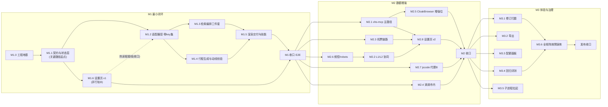

# 旅行规划 DSH 插件 · 实施路线图

| 项 | 内容 |
|---|---|
| 文档版本 | v1.0（首版：将设计文档 §12 的 M1/M2/M3 里程碑展开为可执行工作包） |
| 项目代号 | dsh-travel |
| 配套文档 | [需求文档](./requirements.md) · [设计文档](./design.md) |
| 文档定位 | 设计文档 §12 是里程碑级摘要，本文是它的**执行展开**：工作包拆解、依赖排序、验收锚点、验证策略。内容冲突时以设计文档为准；设计文档变更须同步本文。 |

---

## 1. 总体策略

### 1.1 五条实施原则

1. **零 key 优先**：M1 主线全部基于免 key 通道构建（腾讯 map-assistant / 12306 MCP / Open-Meteo / Leaflet+OSM / L0 宿主搜索，即设计 §4.4 零 key 流），key 渠道（高德 REST / 携程问道 / flyai / 滴滴 / jscode）作为增量解锁。保证"最小密钥启动"（设计原则 7）的闭环**最早**可用，且每个 key 解锁后只需验证增量。
2. **垂直切片，先薄后厚**：M1 内部先打通 `intake → research → build → render` 最小链路（单一目的地、少量情报、Leaflet 地图），尽早形成端到端演示（M1-alpha，见 §3.8），再横向铺满 7 类情报与全部渠道。
3. **契约先行**：§5.5 数据模型与 §5.1 适配器契约（CanonicalQuery/CanonicalResult、`EngineError{UNAVAILABLE|EMPTY|TIMEOUT}`、degraded 记账、Key 解析链）在 M1.1 固化为 TypeScript 类型与基类。此后所有工作包面向契约编码，换源/增源不碰工具层（NFR-7、ADR-2/ADR-6 的工程落点）。
4. **验收锚定**：每个工作包的 DoD（完成定义）挂到设计 §2.1 渠道矩阵的某一行或需求文档某条验收标准；里程碑收口跑 §7 定义的 E2E 剧本，不靠自评。
5. **热读取内建**：Key 解析顺序（settings → credentials → env，ADR-12）与渠道开关过滤在适配器基类从第一天生效。设置卡 UI（M1.6）只是这条链的一个写入面，不是后补的壳。

### 1.2 估时口径与角色

- 规模记法：**S ≤1 人日 / M = 2~3 人日 / L = 4~5 人日**。估时仅用于排序与并行度判断，不是承诺。
- 假设 1 人串行开发（标注了可并行的轨道）；2 人时可按 §6 并行轨压缩约 35%。
- 全局 DoD（每个工作包默认继承）：`tsc` 零错误（NFR-8）、`dev_build_plugin` 构建通过、注入后 `dev_plugin_status` 可见、不引入 `@ts-ignore`/`as any`。

---

## 2. 里程碑总览

| 里程碑 | 目标一句话 | 核心交付 | 收口验收锚点（对应设计 §12） |
|---|---|---|---|
| **M1 最小闭环** | 零 key 流全链路跑通真实目的地 | hybrid 骨架 + 契约/状态层 + 7 个适配器（零 key 集）+ research 三件套 + build + render（双 loader）+ SKILL.md + 设置页 v1 | FR-1~8 全部首次满足（FR-3 为 L0+L0.5 抽样形态、FR-4 市内为高德单方案、FR-8 为基础版）；**§2.1 矩阵零 key 行全部成立** |
| **M2 数据增强** | 情报质量与渠道冗余达标 | xiaohongshu-mcp 主路径 + L1/L2 协同 + 机票链路 + 滴滴双方案 + CloakBrowser 增强位 + 频控/robots + jscode 代理模式 + 设置页 v2 | 7 类情报 ≥6/7；社媒三层渠道均实测出现；小红书登录态全链路（含降级切换）；市内双方案；degraded 实测；设置页三项实测 |
| **M3 体验与治理** | 需求 §1.3 全指标 + 矩阵演练通过 | 增量修订打磨 + 导出 + 配额面板 + 回归评测 + 子进程自动拉起 + 全矩阵故障注入 | 需求 §1.3 全部成功指标；**§2.1 渠道降级矩阵全项故障演练通过**（NFR-10）；意图命中率 ≥90% / 误触发率 ≤5% |

M1/M2/M3 合计约 **40~50 人日**（M1 ≈ 15~20，M2 ≈ 12~16，M3 ≈ 11~14）。

---

## 3. M1 最小闭环（6 阶段 + 收口）

### M1.0 工程地基（S）

| 项 | 内容 |
|---|---|
| 工作包 | `dev_scaffold_plugin(form=hybrid)` 起步（设计 §5.1）；落 peerDeps 范围声明、tsconfig、build.sh；确认 lib/ 产物结构；`dev_self_test` 走一遍注入器链路；起草伴随服务部署文档（§10.3：12306 MCP HTTP 模式启动指南） |
| 产出物 | 可构建、可注入、可热重载的空插件骨架 + `docs/deploy.md` 初稿 |
| 依赖 | 无 |
| DoD | `dev_build_plugin` → `dev_inject_plugin` → `dev_plugin_status` 全通；空 `apply(ctx)` 注册成功；tsc 零错误 |

### M1.1 骨架、契约与状态层（M）— 关键路径起点

| 项 | 内容 |
|---|---|
| 工作包 | ① §5.5 五个数据模型（request/intel/transport/advice/itinerary）落为 TS 类型与校验器；② 适配器契约基类：CanonicalQuery/CanonicalResult、EngineError、degraded 记账、`available()`（Key 解析链 settings→credentials→env，ADR-12）、单位/坐标/时间戳归一化工具（GCJ-02 为落盘基准）；③ store 层：`.dsh-travel/<planId>/` 读写、request.json 落盘、§5.4 状态机七态转换；④ 工具三件：`travel_intake`（含 recommend 模式、必填/日期/天数一致校验、默认值+assumptions 明示）、`travel_get_state`、`travel_update_request`（patch + rerunHints）；⑤ SKILL.md **初稿**（frontmatter + 流程骨架，先立起 FR-1 触发面，供后续阶段对话实测）；⑥ **宿主面冒烟 spike**：`ctx.webServer.register(prefix)`、`ctx.credentials` 读取、settings 命名空间读取各写一个最小样例，消除 M1.5/M1.6 的框架面假设风险 |
| 产出物 | `src/store/`、`src/adapters/base.ts`、`src/tools/intake.ts`、`src/tools/state.ts`、`src/tools/update.ts`、`skills/travel-planner/SKILL.md`、类型定义文件 |
| 依赖 | M1.0 |
| DoD | intake 校验规则单测全过（含"recommend 模式 destination 不计入 missing"）；状态机非法转换被拒；三工具注入后 LLM 实调成功；宿主面三 spike 样例运行留证 |

### M1.2 适配器层·零 key 集（L，内部高度可并行）

按 §5.1 适配器清单，M1 建 7 个（`xhs.ts`、`didi.ts` 留 M2）：

| 适配器 | M1 范围 | 要点 |
|---|---|---|
| `search.ts` | L0 宿主搜索 + **L0.5 直抓** | site: 构造（尽力而为非硬过滤）；去重键=**笔记 ID（URL 路径段）**非全串；L0.5 覆盖小红书 explore（`window.__INITIAL_STATE__` SSR 块：正文/作者/时间/赞藏评转，**命中即抓、缓存结果**因 xsec_token 时效）、知乎专栏、B站视频页 |
| `social.ts`（基础版） | 抖音 L0 搜 URL（摘要级）；三层平台 L0 兜底 | 抖音正文 L2 渲染与三层平台 L1 登录态均留 M2；M1 形态=仅标题摘要并如实标注 |
| `tencent.ts` | `poi_search`/`poi_nearby`（评分/人均/营业时间）/`weather`（5 天）/`distance_matrix`/`travel_guide` | 零 key 体验通道；原生 GCJ-02 直落 coords；体验通道限流→正式 TMAP key 的切换位 |
| `rail12306.ts` | drfccv MCP 只读查询 | HTTP 模式优先；**只读红线**（工具白名单）；互备接口预留（M2 接 wendao/flyai） |
| `amap.ts` | REST：direction(transit)/weather/distance_matrix/geocoder | Key 门控（无 key→available()=false）；配额计数器 + 30 天 POI 缓存 + 单次规划预算（POI ≤40 / REST ≤60，NFR-6） |
| `intercity.ts` | 机票搜索降级 + 汽车票咨询级（搜索结构化） | wendao/flyai 位留接口（M2.3 填充）；bus 为 P1 咨询级定位 |
| `wendao.ts`（可选） | 有 key 才活 | 实测已验证的 API（§3.3）；Markdown 解析 + m.ctrip.com 深链提取；无 key 自动休眠 |

| 项 | 内容 |
|---|---|
| 产出物 | `src/adapters/` 7 文件 + 每适配器 golden fixture（录制真实响应→断言归一化输出） |
| 依赖 | M1.1（契约基类） |
| DoD | 各源→CanonicalResult 归一化 golden 用例过（单位秒→分钟、分→元、时间戳→ISO8601、坐标统一 GCJ-02）；EngineError→degraded 链路单测；amap 配额熔断触发用例；**渠道开关关闭时 fan-out 前置过滤生效**（ADR-12 热读取）；live smoke 用例以 flag 隔离（默认离线 fixture 跑） |

### M1.3 检索编排三件套（M~L）

| 项 | 内容 |
|---|---|
| 工作包 | ① `travel_research_destination`：7 类情报 fan-out（M1 渠道集：小红书 L0+L0.5 / 抖音 L0 / 二层 L0+L0.5 / 三层 L0 / **腾讯 POI 补充** / 平台情报 web_search），聚合去重（笔记 ID / POI ID）、冲突标注 `conflictsWith`、时效降权（>12 个月）、条目级来源落盘 intel.json；② `travel_research_transport`：rail=12306 MCP；flight=搜索降级；bus=咨询级；市内衔接=高德 direction(transit) **单方案**（M1 形态）；≥2 城际方案对比（时间/价格/舒适度/带娃老人适配）；③ `travel_research_advice`：天气链 高德→腾讯→Open-Meteo（含超预报窗口→气候概况标注）+ 穿衣/物品 L0 搜索；④ 三工具统一：并行超时预算（§6 表）、单源重试 ≤2 次指数退避（§9.3-1）、`presentCall` 进度反馈（NFR-9）、对话内只回摘要卡片 |
| 产出物 | `src/tools/research-destination.ts`、`research-transport.ts`、`research-advice.ts` + fan-out 编排器 |
| 依赖 | M1.2 |
| DoD | FR-3 验收①（M1 形态）：任一目的地 7 类 ≥6/7；FR-4 验收①：≥2 方案且 ≥1 含班次时间与价格档；单源超时注入→其余源完成 + degraded[] 返回（NFR-1/2 雏形）；天气条目含数据日期与来源（FR-5 验收①） |

### M1.4 行程生成与动线校验（M）

| 项 | 内容 |
|---|---|
| 工作包 | ① `travel_build_itinerary`：draft 参数校验（intelRefs 引用存在性）、draft 缺省时基于 intel 自动提案、修订时未受影响天结构原样保留；② routeCheck：高德 distance_matrix/direction 为主 → 腾讯零 key 渠道二 → 直线距离估算兜底（标注），输出 issues/warnings（跨城折返、单日跨度告警） |
| 产出物 | `src/tools/build-itinerary.ts` + route-check 模块 |
| 依赖 | M1.2（可与 M1.3 并行：只依赖适配器与数据模型） |
| DoD | 构造跨城折返 draft 必须触发 issue（FR-6 验收①的否用例）；修订场景未受影响天 stops 结构逐项相等（FR-6 验收②）；高德缺 key 时校验自动降级腾讯→直线估算（§2.1 FR-6 行演练） |

### M1.5 渲染交付与技能完整化（M~L）

| 项 | 内容 |
|---|---|
| 工作包 | ① `template.html` 双 loader：高德 JSAPI 2.0（key+jscode 明文注入+域名白名单，§8 方案 A）/ Leaflet+OSM 免 key（GCJ-02→WGS-84 转换，attribution 遵守 OSM 政策）；前端**零 POI 调用**；② `render.ts`：Itinerary JSON→自包含 HTML（数据内嵌+CDN loader），落 `page.html`；③ `ctx.webServer.register({kind:"prefix"})` 路由幂等注册 + 本地文件双通道；④ 页面八区结构（§8）：总览卡/地图区（markers 按天配色+polyline+InfoWindow 含评分人均与溯源）/按天时间轴/交通卡/美食住宿避雷卡（**登录态标注位**，M2 用）/建议卡（物品清单可勾选）；响应式；⑤ SKILL.md 完整化：§7 八条领域指令全量（流程骨架/两模式/轻量路径 P1/追问规则/来源纪律/合规红线/修订规则/降级沟通） |
| 产出物 | `src/render/template.html`、`render.ts`、`src/tools/render-page.ts`、SKILL.md 定稿 |
| 依赖 | M1.1（模板前端可提前用 fixture itinerary 并行开发）；集成联调依赖 M1.4 |
| DoD | 零 key 下 Leaflet 页面可缩放/拖拽/点击弹窗，点位数=stops 数（FR-7 验收①②）；有 key 时 amap loader 实测；无 key 自动降级 Leaflet（§2.1 FR-7 地图行）；同 planId 重渲染路由幂等（§9.2 修订路径）；全部来源链接可点击（FR-7 验收③） |

### M1.6 设置页 v1（M，可与 M1.3/M1.4 并行的独立轨）

| 项 | 内容 |
|---|---|
| 工作包 | ① client 半：`exports["./client"]` + `slots.inject('settings.plugin.item')` 注册 + locale 双语；② settings 命名空间 `travel` 三组模型落 schema（§10.1：channels 核心开关 + keys secret 脱敏 + advanced）；③ `form.ts`：`settingsScope.bind({namespace:'travel'})` 读写、save/discard；④ **热读取接线收口**：适配器基类的 Key 解析链与渠道过滤接上 settings 快照（M1.1 埋的位在此贯通） |
| 产出物 | `src/client/` 五文件（index/SettingsCard/form/fields/locales） |
| 依赖 | M1.1（spike 已验证注册机制）；不阻塞工具链轨 |
| DoD | FR-8 验收①②③：设置卡出现在 DSH 设置-插件页可操作；开关切换下一次工具调用即生效（关腾讯 POI→intel 里该渠道条目消失并计入 degraded）；Key 新增/编辑/删除持久化 + 脱敏显示；删除某 Key→对应渠道 available()=false→degraded 标注（验收④） |

### M1 收口验收（M）

跑 §7 E2E 剧本 A~E 全量 + 零 key 行逐行核对（§2.1）：**断高德/wendao 全部 key，仅凭 腾讯 POI + 12306 MCP + Open-Meteo + Leaflet + L0 搜索 完成一次真实目的地规划**，产出可交互行程页。任一剧本失败回到对应工作包，不进入 M2。

---

## 4. M2 数据增强（8 工作包）

### M2.1 xiaohongshu-mcp 主路径（M）— M2 关键路径

| 项 | 内容 |
|---|---|
| 工作包 | Docker/npm 部署与文档（首启下载约 150MB 无头浏览器）；`search_feeds` **只读白名单挂载**（发布/评论/点赞类工具一律不注册，§5.6 工具收敛）；授权流程：`enableXhsMcp` 开关 + 首次使用对话确认（文案明示"以你的登录会话抓取…仅用于本次旅行规划"+**账号封禁风险**）；会话失效检测→自动降级 L0 种子+L0.5 直抓；channel=xhs-mcp 条目「登录态获取」标注贯通到行程页 |
| 产出物 | `src/adapters/xhs.ts` + 授权状态管理 + 部署文档 |
| 依赖 | M1.2（search.ts 的 L0/L0.5 降级链已就绪，本包只加主路径） |
| DoD | 登录态搜索全链路（扫码→search_feeds→intel 条目→行程页标注）；**会话失效注入→自动降级 L0+L0.5 切换实测**；挂载工具面核验无发布/评论类；频控 10 req/min 生效 |

### M2.2 L1/L2 协同（M）

| 项 | 内容 |
|---|---|
| 工作包 | ① L1：dsh-web-search-pro 协同（微博/豆瓣/贴吧/快手登录态定向为主方案，`save-login.mjs` 一次登录）；② L2：Playwright MCP 渲染抽取抖音正文（JS 渲染必需）；③ `socialDepth` 配置驱动三层渠道优先级预算（一层优先配额与深度，预算受限低层先降级，§5.4 用户决策） |
| 产出物 | `social.ts` 完整版（L1/L2 层补全）+ 渠道预算调度 |
| 依赖 | M1.2、M2.6（频控） |
| DoD | FR-3 验收③④：社媒三层渠道均实测出现；第一层级（小红书/抖音）内容必现且抖音为正文级；L2 失败→仅标题摘要降级实测 |

### M2.3 机票链路：wendao + flyai（M）

| 项 | 内容 |
|---|---|
| 工作包 | ① `wendao.ts` 正式接入：请求模板拼接（`查询{date}{origin}到{destination}的{mode}票`）→ Markdown 解析 → 深链提取；② flyai 适配：flag 映射 + 枚举翻译表（二等座→second class）；③ 降级链编排 wendao→flyai→搜索；火车互备位同步接通（12306 不可用→wendao/flyai） |
| 产出物 | `intercity.ts` 完整版 + `wendao.ts` 正式版 |
| 依赖 | M1.2 |
| DoD | 三档实调各留证：有 wendao key / 仅 flyai / 零 key 搜索降级，均产出 ≥1 机票方案或明示人工比价+官方渠道链接（§2.1 FR-4 城际行全链成立）；12306 故障注入→互备切换实测 |

### M2.4 滴滴市内衔接（S~M）

| 项 | 内容 |
|---|---|
| 工作包 | `didi.ts`：查询类工具白名单（`maps_direction_transit`/`taxi_estimate`；**下单/订单/司机位置/取消四件交易类红线排除**）；前置地理编码链（适配器内链式调腾讯/高德 geocoder，模型无感）+ 城市名补"市"；cityTransfer 高德/滴滴双方案聚合 |
| 产出物 | `src/adapters/didi.ts` |
| 依赖 | M1.3 |
| DoD | 市内衔接双方案对比输出（FR-4 城际+市内验收）；滴滴失败→高德单方案不阻塞；`DIDI_MCP_KEY` 未配→渠道静默降级并标注 |

### M2.5 CloakBrowser 增强位（S）

| 项 | 内容 |
|---|---|
| 工作包 | `enableCloakBrowser` 双重授权（默认 **off**）；profile 置 `.dsh-travel/.profiles/<platform>/`、7 天 TTL 自动删除、一键清除；遇验证码即中止该源降级（不求解）；license key 经设置页管理 |
| 产出物 | CloakBrowser 适配分支 + profile 生命周期管理 |
| 依赖 | M2.1（同一授权/合规框架） |
| DoD | 默认关闭核验；开启需设置开关+对话确认双重动作；§5.6 边界表逐条对照留证；profile TTL 过期自动删除实测 |

### M2.6 治理开关：频控与 robots（S）

| 项 | 内容 |
|---|---|
| 工作包 | 适配器层令牌桶（默认 10 req/min/域，可配 `rateLimitPerDomain`）；robots/ToS 检查开关（默认开，NFR-4） |
| 产出物 | 适配器基类治理模块 |
| 依赖 | M1.2（基类） |
| DoD | 频控超限→请求排队/熔断用例；robots 禁抓路径→该源降级用例；配置热读取生效 |

### M2.7 jscode 代理模式 B（S）

| 项 | 内容 |
|---|---|
| 工作包 | 插件 webserver 路由兼任安全密钥代理（`_AMapSecurityConfig.serviceHost` 指向本插件路由），jscode 不出现在前端产物（§8 方案 B，与方案 A 可配置切换） |
| 产出物 | webserver 安全代理路由 + loader 配置项 |
| 依赖 | M1.5 |
| DoD | 模式 B 下前端产物（page.html）grep 无 jscode 明文；A/B 切换配置实测 |

### M2.8 设置页 v2（M）

| 项 | 内容 |
|---|---|
| 工作包 | ① 完整渠道开关矩阵（§10.1 channels 全量：FR-3~7 × 渠道独立启停，被停渠道计入 degraded「已停用（用户配置）」）；② 保存时 NFR-10 冗余校验（任一 FR 启用渠道 <2 → 软警示，允许强制保存）；③ Key 脱敏查看（`b235****911c` + 二次确认）；④ 无 Key 渠道标注（xiaohongshu-mcp/web-search-pro/12306/Playwright） |
| 产出物 | SettingsCard 完整版 |
| 依赖 | M1.6 + M2.1~M2.5 渠道就位 |
| DoD | FR-8 验收⑤：关闭渠道致 <2 时警示弹窗实测；开关矩阵逐项切换对 fan-out 的影响实测；Key 查看完整值二次确认实测 |

### M2 收口验收（S~M）

设计 §12 M2 锚点全量：7 类覆盖率 ≥6/7 保持；社媒三层均出现；小红书登录态全链路（含降级切换）；市内双方案；degraded 机制汇总实测；设置页三项（开关即时生效/Key CRUD 持久化/冗余警示）留证。跑 §7 剧本 A~E 的**有 key 增强版**。

---

## 5. M3 体验与治理（6 工作包）

### M3.1 修订流程打磨（M）

`rerunHints` 精细化（槽位变化→只重跑受影响 research 项）；修订场景扩展实测（换酒店区域/压缩行程/改日期各一例）；draft 增量语义回归用例固化。

### M3.2 导出（S~M）

行程页导出入口：JSON / Markdown 下载 + 打印 PDF（FR-7 详细要求 4，P2）。

### M3.3 配额统计面板（S~M）

高德 POI/REST 调用计数、搜索预算消耗、缓存命中率、degraded 汇总——呈现于设置卡高级组或独立面板（NFR-6 的可视化）。

### M3.4 回归评测（M~L）

① OSU TravelPlanner 1,225 任务抽样（建议 50~100 条国内单目的地任务）作回归集；② 意图评测集：20 条旅行表述（命中率 ≥90%）+ 20 条非旅行表述（误触发率 ≤5%），口径=FR-1 验收标准；③ 评测脚本化，可重复执行。

### M3.5 子进程自动拉起（M）

12306 MCP / xiaohongshu-mcp / Playwright MCP / 滴滴 MCP 生命周期管理：按需 spawn、健康检查、退出清理（§10.3 把"文档指导启动"升级为自动）。

### M3.6 全矩阵故障注入演练（M）— M3 关键路径

对 §2.1 矩阵**逐渠道**注入故障（停 key / 断服务 / 超时 / 限流），验证每行"渠道一失效→降级链产出、流程不中断"；统计 NFR-2 整体成功率 ≥95%（一次成功口径见需求文档）；产出演练报告作为 NFR-10 验收证据。

### M3 收口验收

需求 §1.3 五条成功指标全量复核 + FR-1~8 全部验收标准逐条留证 + §2.1 全矩阵演练报告。至此版本可对外发布。

---

## 6. 工作包依赖与并行图

**并行说明**：
- **轨道 A（工具链）** M1.2→M1.3→M1.4→M1.5 串行为关键路径；M1.4 实际只依赖 M1.2，可与 M1.3 并行；M1.5 的 template.html 前端可自 M1.1 起用 fixture 数据并行开发。
- **轨道 B（设置卡）** M1.1→M1.6 独立推进，唯一汇合点是"热读取接线"（M1.6 ④，需在 M1 收口前完成）。
- M1.2 内部 7 个适配器相互独立，是最大的并行化单元。
- M2 阶段 M2.1/M2.3/M2.6/M2.7/M2.4 五包无相互依赖，可全并行。
- **M1-alpha 薄切片**（M1 中点演示锚）：M1.1 + M1.2 的 tencent.ts/search.ts + M1.3 的 research_destination（仅 POI+L0 薄版）+ M1.4 自动提案 + M1.5 Leaflet-only —— 即可演示"一句话→行程页"端到端，用于早期方向校准。

---

## 7. 验证策略（分层）

| 层 | 手段 | 覆盖 | 时机 |
|---|---|---|---|
| V1 类型与契约 | `tsc` 零错误 + 数据模型校验器单测 | §5.5 全模型、状态机转换 | 每工作包 |
| V2 适配器 golden | 录制真实响应→断言归一化输出（离线 fixture）；live smoke 以 flag 隔离 | 每源→CanonicalResult、EngineError→degraded | M1.2 起每适配器 |
| V3 工具级实测 | dev_inject_plugin 注入后 LLM/脚本实调单工具 | 8 个 travel_* 工具的参数/超时/降级/预算 | 每工具完成时 |
| V4 E2E 对话剧本 | §7 剧本（下表）人工+脚本混合执行 | 全流程、双模式、修订、降级 | 每里程碑收口 |
| V5 矩阵故障演练 | §2.1 逐渠道故障注入 | NFR-10/NFR-2 | M1（零 key 行）→ M2（增量行）→ M3（全量） |
| V6 回归评测 | OSU TravelPlanner 抽样 + 意图 20+20 评测集 | 成功率、命中率/误触发率 | M3.4 |

**E2E 剧本清单**（V4 用，收口必跑）：

| # | 剧本 | 覆盖 |
|---|---|---|
| A | 规划模式零 key："帮我规划十一杭州三日游" → 追问 ≤3 轮 → 确认 → 三 research → build → render → Leaflet 页交互 + 全条目溯源 | FR-1/2/3/4/5/6/7 + §1.3 指标 1~5 |
| B | 推荐模式："推荐几个适合带老人玩的海边城市" → 候选 3~5 带来源 → 选定回注 → 转规划 | FR-2 推荐分支 + 验收④ |
| C | 修订："第二天太满，删掉一个点" → 仅第二天变化 → 同 planId 重渲染 | FR-6 验收② + §9.2 |
| D | 降级：断高德/wendao key + 关闭渠道开关 → 全流程仍产出（零 key 行） | NFR-2/NFR-10 + FR-8 验收②④ |
| E | 轻量路径："查下明天北京到上海的高铁" → 直答不强收槽位 | FR-1 详细要求 5（P1） |

---

## 8. 实施风险与路线图联动（设计 §11 之外的工程侧增量）

| 风险 | 等级 | 路线图应对 |
|---|---|---|
| DSH 插件 API 表面假设（slots/settingsScope/webServer 组合形态）与宿主版本漂移 | 中 | M1.1 宿主面冒烟 spike 前置消除；机制先例 dsh-web-search-pro 源码作参照（§4.1） |
| xiaohongshu-mcp 首启下载约 150MB + 扫码登录的部署摩擦 | 中 | M2.1 文档化；M3.5 自动拉起收尾；未部署不阻塞（降级链 M1 已备） |
| 外部平台页面结构变化导致 golden fixture 失效 | 中 | fixture 与 live smoke 分离（flag），live 失败只降级标记不挂 CI；适配器小文件易热替换 |
| L0.5 直抓对 xsec_token 时效敏感 | 中 | "命中即抓、缓存抓取结果而非 URL"（§5.4 L0.5 行）在 M1.2 实现为硬规则 |
| E2E 强依赖外网与平台现状，收口验收不可复现 | 中 | 剧本留证（截图+产物+degraded 汇总）；M3.4 回归集脚本化 |
| 估时偏差（适配器数量多、单包小） | 低 | M1.2 按适配器切分为独立可验收单元，偏差局部化 |

---

## 9. 未确认事项对路线图的影响（承接设计 §13）

| 未确认项 | 路线图处置 |
|---|---|
| 携程问道配额/定价不透明 | M2.3 定位为增强源，核心链路零依赖；配额异常降级链已备 |
| 汽车票无稳定结构化源 | 全程 P1 咨询级（M1.2 intercity 搜索形态即终态候选）；若后续发现稳定源，按适配器契约增量接入（NFR-7） |
| 高德天气配额分类未确认 | M1.3 按保守预算（每日 1 次/规划）；腾讯/Open-Meteo 双渠道兜底 |
| CloakBrowser Pro 价格与闭源边界 | M2.5 默认 off 不进核心链路；开启前置双重授权 |
| 程心大模型开放接入方式 | 不排期；出现在 §13 清单跟踪即可 |

---

## 修订记录

- v1.0（2026-09-02）：首版。将设计文档 §12 M1/M2/M3 展开为 20 个工作包（M1×6 + M2×8 + M3×6）与三次收口验收；确立五条实施原则（零 key 优先/垂直切片/契约先行/验收锚定/热读取内建）、M1-alpha 薄切片演示锚、六层验证策略与 E2E 剧本 A~E、FR/NFR×里程碑追溯表（§3 各工作包 DoD 内嵌）。
- **qinggan 数据质量专项 W0-W4**（2026-09-08，计划 `.omo/plans/qinggan-data-quality-repair.md`）：确定性串行链落地——兴趣情报（researchIntent）→ 调用方驱动深度研究（多轮增量/指定正文/分块读取/充分性门，DR1-DR3）→ 地理解析（resolve_places + route-coverage lineage）→ 串行交通（前置门 + 出发/各段 route-transport）→ 按地点天气（advice placeId 归属）→ 可选酒店报价（lodging-quotes，DIDA 默认关）→ build/render；版本旁车/原子发布/迟到写拒绝/失效 DAG 全链；W4 同波集成 skill 主线、DAG 代码门、state 研究视图、页面/导出正文分级、全部新工具注册与打包（Python 桥随 lib）。**口径**：新外部源/可选提取器（DIDA/OSM/5A/Trafilatura）默认关或按许可证据就绪为准，不把「新增能力」标成已上线源；本专项非平台全量采集承诺。
